Google Data Analytics Certificate Capstone (Bellabeat Case Study)
================
Gabriel Fernandez

``` r
# Set default options for code chunks
knitr::opts_chunk$set(
  echo = TRUE,          # Display R code and its output
  comment=NA,           # Suppress code comments in output
  warning = FALSE,      # Suppress warning messages
  fig.align='center',   # Align figures in the center
  eval = TRUE           # Evaluate R code
)
```

# Prepare and preprocess phase

``` r
# Import libraries 
library(tidyverse) # includes ggplot2
library(skimr) #  provides a compact and informative summary of your dataframe or dataset
library(lubridate)
library(janitor) # set of utility functions for data cleaning and data frame tidying tasks
library(RColorBrewer) # Color palettes for data visualization
library(ggcorrplot) # Visualize correlation matrices using ggplot2
library(scales) # formatting and transforming data for visualizations


# display.brewer.all(colorblindFriendly = TRUE)
```

## Load datasets

- [Datasets:](https://www.kaggle.com/datasets/arashnic/fitbit)

These datasets originate from a survey distributed on Amazon Mechanical
Turk from 03.12.2016 to 05.12.2016. They include personal tracker data
from 30 Fitbit users, covering physical activity, heart rate, and sleep
monitoring, with differentiation based on Fitbit types and user
behavior.

- Metadata: [Fitbit data
  dictionary](https://www.fitabase.com/resources/knowledge-base/exporting-data/data-dictionaries/)

``` r
# Clean environment
rm(list = ls())

daily_activity <-
  read_csv("original_data/dailyActivity_merged.csv",
    trim_ws = TRUE,
    show_col_types = FALSE
  )

daily_sleep <- read_csv("original_data/sleepDay_merged.csv",
  trim_ws = TRUE,
  show_col_types = FALSE
)

hourly_calories <-
  read_csv("original_data/hourlyCalories_merged.csv",
    trim_ws = TRUE,
    show_col_types = FALSE
  )

hourly_intensities <-
  read_csv("original_data/hourlyIntensities_merged.csv",
    trim_ws = TRUE,
    show_col_types = FALSE
  )
hourly_steps <-
  read_csv("original_data/hourlySteps_merged.csv",
    trim_ws = TRUE,
    show_col_types = FALSE
  )

minute_sleep <-
  read_csv("original_data/minuteSleep_merged.csv",
    trim_ws = TRUE,
    show_col_types = FALSE
  )

seconds_heartrate <-
  read_csv("original_data/heartrate_seconds_merged.csv",
    trim_ws = TRUE,
    show_col_types = FALSE
  )

weight_logs <-
  read_csv("original_data/weightLogInfo_merged.csv",
    trim_ws = TRUE,
    show_col_types = FALSE
  )

# Remove trailing spaces (trim_ws = TRUE)
```

## Clean datasets

### Clean the daily_activity dataset

``` r
# Check daily_activity dataset before cleaning
glimpse(daily_activity)
```

    Rows: 940
    Columns: 15
    $ Id                       <dbl> 1503960366, 1503960366, 1503960366, 150396036…
    $ ActivityDate             <chr> "4/12/2016", "4/13/2016", "4/14/2016", "4/15/…
    $ TotalSteps               <dbl> 13162, 10735, 10460, 9762, 12669, 9705, 13019…
    $ TotalDistance            <dbl> 8.50, 6.97, 6.74, 6.28, 8.16, 6.48, 8.59, 9.8…
    $ TrackerDistance          <dbl> 8.50, 6.97, 6.74, 6.28, 8.16, 6.48, 8.59, 9.8…
    $ LoggedActivitiesDistance <dbl> 0, 0, 0, 0, 0, 0, 0, 0, 0, 0, 0, 0, 0, 0, 0, …
    $ VeryActiveDistance       <dbl> 1.88, 1.57, 2.44, 2.14, 2.71, 3.19, 3.25, 3.5…
    $ ModeratelyActiveDistance <dbl> 0.55, 0.69, 0.40, 1.26, 0.41, 0.78, 0.64, 1.3…
    $ LightActiveDistance      <dbl> 6.06, 4.71, 3.91, 2.83, 5.04, 2.51, 4.71, 5.0…
    $ SedentaryActiveDistance  <dbl> 0, 0, 0, 0, 0, 0, 0, 0, 0, 0, 0, 0, 0, 0, 0, …
    $ VeryActiveMinutes        <dbl> 25, 21, 30, 29, 36, 38, 42, 50, 28, 19, 66, 4…
    $ FairlyActiveMinutes      <dbl> 13, 19, 11, 34, 10, 20, 16, 31, 12, 8, 27, 21…
    $ LightlyActiveMinutes     <dbl> 328, 217, 181, 209, 221, 164, 233, 264, 205, …
    $ SedentaryMinutes         <dbl> 728, 776, 1218, 726, 773, 539, 1149, 775, 818…
    $ Calories                 <dbl> 1985, 1797, 1776, 1745, 1863, 1728, 1921, 203…

``` r
# Check missing values and duplicates
cat(
  "\n",
  "Missing values:",
  sum(is.na(daily_activity)),
  "\n",
  "Duplicate values:",
  sum(duplicated(daily_activity)),
  "\n",
  "Unique Ids:",
  n_distinct(daily_activity$Id)
)
```


     Missing values: 0 
     Duplicate values: 0 
     Unique Ids: 33

Let us clean:

- Change column names to lower case because R is case sensitive.

- Change “Id” from double to a character because the number represents a
  category.

- Change “ActivityDate” from char to date.

``` r
# Clean daily_activity dataset

daily_activity <-
  # Clean column names
  clean_names(daily_activity) %>%
  # Correct column types
  mutate(id = as.character(id)) %>% # from double to chr
  mutate(activity_date = as.Date(activity_date,
                                 format = "%m/%d/%Y")) %>% # from chr to date
  # Remove duplicate rows
  distinct()

# Check daily_activity dataset after cleaning
glimpse(daily_activity)
```

    Rows: 940
    Columns: 15
    $ id                         <chr> "1503960366", "1503960366", "1503960366", "…
    $ activity_date              <date> 2016-04-12, 2016-04-13, 2016-04-14, 2016-0…
    $ total_steps                <dbl> 13162, 10735, 10460, 9762, 12669, 9705, 130…
    $ total_distance             <dbl> 8.50, 6.97, 6.74, 6.28, 8.16, 6.48, 8.59, 9…
    $ tracker_distance           <dbl> 8.50, 6.97, 6.74, 6.28, 8.16, 6.48, 8.59, 9…
    $ logged_activities_distance <dbl> 0, 0, 0, 0, 0, 0, 0, 0, 0, 0, 0, 0, 0, 0, 0…
    $ very_active_distance       <dbl> 1.88, 1.57, 2.44, 2.14, 2.71, 3.19, 3.25, 3…
    $ moderately_active_distance <dbl> 0.55, 0.69, 0.40, 1.26, 0.41, 0.78, 0.64, 1…
    $ light_active_distance      <dbl> 6.06, 4.71, 3.91, 2.83, 5.04, 2.51, 4.71, 5…
    $ sedentary_active_distance  <dbl> 0, 0, 0, 0, 0, 0, 0, 0, 0, 0, 0, 0, 0, 0, 0…
    $ very_active_minutes        <dbl> 25, 21, 30, 29, 36, 38, 42, 50, 28, 19, 66,…
    $ fairly_active_minutes      <dbl> 13, 19, 11, 34, 10, 20, 16, 31, 12, 8, 27, …
    $ lightly_active_minutes     <dbl> 328, 217, 181, 209, 221, 164, 233, 264, 205…
    $ sedentary_minutes          <dbl> 728, 776, 1218, 726, 773, 539, 1149, 775, 8…
    $ calories                   <dbl> 1985, 1797, 1776, 1745, 1863, 1728, 1921, 2…

``` r
# Check missing values and duplicates after cleaning
cat("\n",
    "Missing values:",
    sum(is.na(daily_activity)),
    "\n",
    "Duplicate values:",
    sum(duplicated(daily_activity)))
```


     Missing values: 0 
     Duplicate values: 0

``` r
# Let us print summary statistics to have a better idea of the dataset
daily_activity %>%
  summary()
```

          id            activity_date         total_steps    total_distance  
     Length:940         Min.   :2016-04-12   Min.   :    0   Min.   : 0.000  
     Class :character   1st Qu.:2016-04-19   1st Qu.: 3790   1st Qu.: 2.620  
     Mode  :character   Median :2016-04-26   Median : 7406   Median : 5.245  
                        Mean   :2016-04-26   Mean   : 7638   Mean   : 5.490  
                        3rd Qu.:2016-05-04   3rd Qu.:10727   3rd Qu.: 7.713  
                        Max.   :2016-05-12   Max.   :36019   Max.   :28.030  
     tracker_distance logged_activities_distance very_active_distance
     Min.   : 0.000   Min.   :0.0000             Min.   : 0.000      
     1st Qu.: 2.620   1st Qu.:0.0000             1st Qu.: 0.000      
     Median : 5.245   Median :0.0000             Median : 0.210      
     Mean   : 5.475   Mean   :0.1082             Mean   : 1.503      
     3rd Qu.: 7.710   3rd Qu.:0.0000             3rd Qu.: 2.053      
     Max.   :28.030   Max.   :4.9421             Max.   :21.920      
     moderately_active_distance light_active_distance sedentary_active_distance
     Min.   :0.0000             Min.   : 0.000        Min.   :0.000000         
     1st Qu.:0.0000             1st Qu.: 1.945        1st Qu.:0.000000         
     Median :0.2400             Median : 3.365        Median :0.000000         
     Mean   :0.5675             Mean   : 3.341        Mean   :0.001606         
     3rd Qu.:0.8000             3rd Qu.: 4.782        3rd Qu.:0.000000         
     Max.   :6.4800             Max.   :10.710        Max.   :0.110000         
     very_active_minutes fairly_active_minutes lightly_active_minutes
     Min.   :  0.00      Min.   :  0.00        Min.   :  0.0         
     1st Qu.:  0.00      1st Qu.:  0.00        1st Qu.:127.0         
     Median :  4.00      Median :  6.00        Median :199.0         
     Mean   : 21.16      Mean   : 13.56        Mean   :192.8         
     3rd Qu.: 32.00      3rd Qu.: 19.00        3rd Qu.:264.0         
     Max.   :210.00      Max.   :143.00        Max.   :518.0         
     sedentary_minutes    calories   
     Min.   :   0.0    Min.   :   0  
     1st Qu.: 729.8    1st Qu.:1828  
     Median :1057.5    Median :2134  
     Mean   : 991.2    Mean   :2304  
     3rd Qu.:1229.5    3rd Qu.:2793  
     Max.   :1440.0    Max.   :4900  

- This summary helps us explore each attribute quickly. We notice that
  some attributes have a minimum value of zero (total_step,
  total_distance, calories). Let us explore this observation.

``` r
# Check where total_steps is zero
filter(daily_activity, total_steps == 0) 
```

    # A tibble: 77 × 15
       id         activity…¹ total…² total…³ track…⁴ logge…⁵ very_…⁶ moder…⁷ light…⁸
       <chr>      <date>       <dbl>   <dbl>   <dbl>   <dbl>   <dbl>   <dbl>   <dbl>
     1 1503960366 2016-05-12       0       0       0       0       0       0       0
     2 1844505072 2016-04-24       0       0       0       0       0       0       0
     3 1844505072 2016-04-25       0       0       0       0       0       0       0
     4 1844505072 2016-04-26       0       0       0       0       0       0       0
     5 1844505072 2016-05-02       0       0       0       0       0       0       0
     6 1844505072 2016-05-07       0       0       0       0       0       0       0
     7 1844505072 2016-05-08       0       0       0       0       0       0       0
     8 1844505072 2016-05-09       0       0       0       0       0       0       0
     9 1844505072 2016-05-10       0       0       0       0       0       0       0
    10 1844505072 2016-05-11       0       0       0       0       0       0       0
    # … with 67 more rows, 6 more variables: sedentary_active_distance <dbl>,
    #   very_active_minutes <dbl>, fairly_active_minutes <dbl>,
    #   lightly_active_minutes <dbl>, sedentary_minutes <dbl>, calories <dbl>, and
    #   abbreviated variable names ¹​activity_date, ²​total_steps, ³​total_distance,
    #   ⁴​tracker_distance, ⁵​logged_activities_distance, ⁶​very_active_distance,
    #   ⁷​moderately_active_distance, ⁸​light_active_distance

- We found 77 observations where total_steps is zero. We should delete
  these observations so they do not affect our mean and median. If the
  total_step is zero, the person did not wear the Fitbit.

``` r
# Check where calories is zero
filter(daily_activity, calories == 0)
```

    # A tibble: 4 × 15
      id         activity_…¹ total…² total…³ track…⁴ logge…⁵ very_…⁶ moder…⁷ light…⁸
      <chr>      <date>        <dbl>   <dbl>   <dbl>   <dbl>   <dbl>   <dbl>   <dbl>
    1 1503960366 2016-05-12        0       0       0       0       0       0       0
    2 6290855005 2016-05-10        0       0       0       0       0       0       0
    3 8253242879 2016-04-30        0       0       0       0       0       0       0
    4 8583815059 2016-05-12        0       0       0       0       0       0       0
    # … with 6 more variables: sedentary_active_distance <dbl>,
    #   very_active_minutes <dbl>, fairly_active_minutes <dbl>,
    #   lightly_active_minutes <dbl>, sedentary_minutes <dbl>, calories <dbl>, and
    #   abbreviated variable names ¹​activity_date, ²​total_steps, ³​total_distance,
    #   ⁴​tracker_distance, ⁵​logged_activities_distance, ⁶​very_active_distance,
    #   ⁷​moderately_active_distance, ⁸​light_active_distance

``` r
# Check where total_distance is zero
filter(daily_activity, total_distance == 0)
```

    # A tibble: 78 × 15
       id         activity…¹ total…² total…³ track…⁴ logge…⁵ very_…⁶ moder…⁷ light…⁸
       <chr>      <date>       <dbl>   <dbl>   <dbl>   <dbl>   <dbl>   <dbl>   <dbl>
     1 1503960366 2016-05-12       0       0       0       0       0       0       0
     2 1844505072 2016-04-24       0       0       0       0       0       0       0
     3 1844505072 2016-04-25       0       0       0       0       0       0       0
     4 1844505072 2016-04-26       0       0       0       0       0       0       0
     5 1844505072 2016-04-27       4       0       0       0       0       0       0
     6 1844505072 2016-05-02       0       0       0       0       0       0       0
     7 1844505072 2016-05-07       0       0       0       0       0       0       0
     8 1844505072 2016-05-08       0       0       0       0       0       0       0
     9 1844505072 2016-05-09       0       0       0       0       0       0       0
    10 1844505072 2016-05-10       0       0       0       0       0       0       0
    # … with 68 more rows, 6 more variables: sedentary_active_distance <dbl>,
    #   very_active_minutes <dbl>, fairly_active_minutes <dbl>,
    #   lightly_active_minutes <dbl>, sedentary_minutes <dbl>, calories <dbl>, and
    #   abbreviated variable names ¹​activity_date, ²​total_steps, ³​total_distance,
    #   ⁴​tracker_distance, ⁵​logged_activities_distance, ⁶​very_active_distance,
    #   ⁷​moderately_active_distance, ⁸​light_active_distance

- From our inspection above, we can see that we just need to delete the
  entries where total_steps is zero and will take take care of the rest.

``` r
daily_activity_clean <-
  filter(daily_activity,
         total_steps != 0,
         total_distance != 0,
         calories != 0)
daily_activity_clean
```

    # A tibble: 862 × 15
       id         activity…¹ total…² total…³ track…⁴ logge…⁵ very_…⁶ moder…⁷ light…⁸
       <chr>      <date>       <dbl>   <dbl>   <dbl>   <dbl>   <dbl>   <dbl>   <dbl>
     1 1503960366 2016-04-12   13162    8.5     8.5        0    1.88   0.550    6.06
     2 1503960366 2016-04-13   10735    6.97    6.97       0    1.57   0.690    4.71
     3 1503960366 2016-04-14   10460    6.74    6.74       0    2.44   0.400    3.91
     4 1503960366 2016-04-15    9762    6.28    6.28       0    2.14   1.26     2.83
     5 1503960366 2016-04-16   12669    8.16    8.16       0    2.71   0.410    5.04
     6 1503960366 2016-04-17    9705    6.48    6.48       0    3.19   0.780    2.51
     7 1503960366 2016-04-18   13019    8.59    8.59       0    3.25   0.640    4.71
     8 1503960366 2016-04-19   15506    9.88    9.88       0    3.53   1.32     5.03
     9 1503960366 2016-04-20   10544    6.68    6.68       0    1.96   0.480    4.24
    10 1503960366 2016-04-21    9819    6.34    6.34       0    1.34   0.350    4.65
    # … with 852 more rows, 6 more variables: sedentary_active_distance <dbl>,
    #   very_active_minutes <dbl>, fairly_active_minutes <dbl>,
    #   lightly_active_minutes <dbl>, sedentary_minutes <dbl>, calories <dbl>, and
    #   abbreviated variable names ¹​activity_date, ²​total_steps, ³​total_distance,
    #   ⁴​tracker_distance, ⁵​logged_activities_distance, ⁶​very_active_distance,
    #   ⁷​moderately_active_distance, ⁸​light_active_distance

``` r
names(daily_activity)
```

     [1] "id"                         "activity_date"             
     [3] "total_steps"                "total_distance"            
     [5] "tracker_distance"           "logged_activities_distance"
     [7] "very_active_distance"       "moderately_active_distance"
     [9] "light_active_distance"      "sedentary_active_distance" 
    [11] "very_active_minutes"        "fairly_active_minutes"     
    [13] "lightly_active_minutes"     "sedentary_minutes"         
    [15] "calories"                  

``` r
# Check the attributes again

cat("Before deleting the entries\n\n")
```

    Before deleting the entries

``` r
select(daily_activity,total_steps,total_distance,calories) %>%
  summary()
```

      total_steps    total_distance      calories   
     Min.   :    0   Min.   : 0.000   Min.   :   0  
     1st Qu.: 3790   1st Qu.: 2.620   1st Qu.:1828  
     Median : 7406   Median : 5.245   Median :2134  
     Mean   : 7638   Mean   : 5.490   Mean   :2304  
     3rd Qu.:10727   3rd Qu.: 7.713   3rd Qu.:2793  
     Max.   :36019   Max.   :28.030   Max.   :4900  

``` r
cat("\n\n\n",
    "\t\t vs",
    "\n\n\n")
```


             vs 

``` r
cat("After deleting the entries\n\n")
```

    After deleting the entries

``` r
select(daily_activity_clean, total_steps, total_distance, calories) %>%
  summary()
```

      total_steps    total_distance      calories   
     Min.   :    8   Min.   : 0.010   Min.   :  52  
     1st Qu.: 4927   1st Qu.: 3.373   1st Qu.:1857  
     Median : 8054   Median : 5.590   Median :2220  
     Mean   : 8329   Mean   : 5.986   Mean   :2362  
     3rd Qu.:11096   3rd Qu.: 7.905   3rd Qu.:2832  
     Max.   :36019   Max.   :28.030   Max.   :4900  

- We can see that the observation we removed affected our mean and
  median.

### Clean the daily_sleep dataset

``` r
# Check daily_sleep dataset before cleaning
glimpse(daily_sleep)
```

    Rows: 413
    Columns: 5
    $ Id                 <dbl> 1503960366, 1503960366, 1503960366, 1503960366, 150…
    $ SleepDay           <chr> "4/12/2016 12:00:00 AM", "4/13/2016 12:00:00 AM", "…
    $ TotalSleepRecords  <dbl> 1, 2, 1, 2, 1, 1, 1, 1, 1, 1, 1, 1, 1, 1, 1, 1, 1, …
    $ TotalMinutesAsleep <dbl> 327, 384, 412, 340, 700, 304, 360, 325, 361, 430, 2…
    $ TotalTimeInBed     <dbl> 346, 407, 442, 367, 712, 320, 377, 364, 384, 449, 3…

``` r
# Check missing values and duplicates
cat("\n",
    "Missing values:",
    sum(is.na(daily_sleep)),
    "\n",
    "Duplicate values:",
    sum(duplicated(daily_sleep)),
  "\n",
  "Unique Ids:",
  n_distinct(daily_sleep$Id)
    )
```


     Missing values: 0 
     Duplicate values: 3 
     Unique Ids: 24

Let us clean:

- Change column names to lower case because R is case sensitive

- Change “Id” from double to a character because the number represents a
  category

- Change “SleepDay” from char to date. Since the time component of this
  column is the same for each observation”12:00:00 AM”, we can remove
  it. This will helps us merged this dataset with daily_activity later

- Delete duplicates (3 observations are duplicates)

``` r
# Clean daily_sleep dataset

daily_sleep_clean <-
  # Clean column names
  clean_names(daily_sleep) %>%
  # Correct column types
  mutate(id = as.character(id)) %>% # from double to chr
  mutate(sleep_day = as.Date(sleep_day,
                             format = "%m/%d/%Y")) %>% # from chr to date
  # Remove duplicate rows
  distinct()

# Check clean daily_sleep dataset
glimpse(daily_sleep_clean)
```

    Rows: 410
    Columns: 5
    $ id                   <chr> "1503960366", "1503960366", "1503960366", "150396…
    $ sleep_day            <date> 2016-04-12, 2016-04-13, 2016-04-15, 2016-04-16, …
    $ total_sleep_records  <dbl> 1, 2, 1, 2, 1, 1, 1, 1, 1, 1, 1, 1, 1, 1, 1, 1, 1…
    $ total_minutes_asleep <dbl> 327, 384, 412, 340, 700, 304, 360, 325, 361, 430,…
    $ total_time_in_bed    <dbl> 346, 407, 442, 367, 712, 320, 377, 364, 384, 449,…

``` r
# Check missing values and duplicates after cleaning
cat("\n",
    "Missing values:",
    sum(is.na(daily_sleep_clean)),
    "\n",
    "Duplicate values:",
    sum(duplicated(daily_sleep_clean)))
```


     Missing values: 0 
     Duplicate values: 0

### Clean the hourly datasets (hourly_calories, hourly_intensities, and hourly_steps)

``` r
# Check hourly_calories dataset before cleaning
glimpse(hourly_calories)
```

    Rows: 22,099
    Columns: 3
    $ Id           <dbl> 1503960366, 1503960366, 1503960366, 1503960366, 150396036…
    $ ActivityHour <chr> "4/12/2016 12:00:00 AM", "4/12/2016 1:00:00 AM", "4/12/20…
    $ Calories     <dbl> 81, 61, 59, 47, 48, 48, 48, 47, 68, 141, 99, 76, 73, 66, …

``` r
# Check missing values and duplicates
cat("\n",
    "Missing values:",
    sum(is.na(hourly_calories)),
    "\n",
    "Duplicate values:",
    sum(duplicated(hourly_calories)))
```


     Missing values: 0 
     Duplicate values: 0

``` r
# Check hourly_intensities dataset before cleaning
glimpse(hourly_intensities)
```

    Rows: 22,099
    Columns: 4
    $ Id               <dbl> 1503960366, 1503960366, 1503960366, 1503960366, 15039…
    $ ActivityHour     <chr> "4/12/2016 12:00:00 AM", "4/12/2016 1:00:00 AM", "4/1…
    $ TotalIntensity   <dbl> 20, 8, 7, 0, 0, 0, 0, 0, 13, 30, 29, 12, 11, 6, 36, 5…
    $ AverageIntensity <dbl> 0.333333, 0.133333, 0.116667, 0.000000, 0.000000, 0.0…

``` r
# Check missing values and duplicates
cat("\n",
    "Missing values:",
    sum(is.na(hourly_intensities)),
    "\n",
    "Duplicate values:",
    sum(duplicated(hourly_intensities)))
```


     Missing values: 0 
     Duplicate values: 0

``` r
# Check hourly_steps dataset before cleaning
glimpse(hourly_steps)
```

    Rows: 22,099
    Columns: 3
    $ Id           <dbl> 1503960366, 1503960366, 1503960366, 1503960366, 150396036…
    $ ActivityHour <chr> "4/12/2016 12:00:00 AM", "4/12/2016 1:00:00 AM", "4/12/20…
    $ StepTotal    <dbl> 373, 160, 151, 0, 0, 0, 0, 0, 250, 1864, 676, 360, 253, 2…

``` r
# Check missing values and duplicates
cat("\n",
    "Missing values:",
    sum(is.na(hourly_steps)),
    "\n",
    "Duplicate values:",
    sum(duplicated(hourly_steps)))
```


     Missing values: 0 
     Duplicate values: 0

### Join hourly datasets to create a hourly_actitvity dataset

- These datasets shared the same Id and Activity_hour, let us join them
  into a new dataset (hourly_activity) before we clean them.

``` r
# Join the hourly datasets (hourly_calories, hourly_intensities, and hourly_steps)

hourly_activity <-
  inner_join(hourly_calories,
             hourly_intensities,
             by = c("Id", "ActivityHour"))

hourly_activity <-
  inner_join(hourly_activity, hourly_steps, by = c("Id", "ActivityHour"))
```

``` r
# Check hourly_activity dataset before cleaning
glimpse(hourly_activity)
```

    Rows: 22,099
    Columns: 6
    $ Id               <dbl> 1503960366, 1503960366, 1503960366, 1503960366, 15039…
    $ ActivityHour     <chr> "4/12/2016 12:00:00 AM", "4/12/2016 1:00:00 AM", "4/1…
    $ Calories         <dbl> 81, 61, 59, 47, 48, 48, 48, 47, 68, 141, 99, 76, 73, …
    $ TotalIntensity   <dbl> 20, 8, 7, 0, 0, 0, 0, 0, 13, 30, 29, 12, 11, 6, 36, 5…
    $ AverageIntensity <dbl> 0.333333, 0.133333, 0.116667, 0.000000, 0.000000, 0.0…
    $ StepTotal        <dbl> 373, 160, 151, 0, 0, 0, 0, 0, 250, 1864, 676, 360, 25…

``` r
# Check missing values and duplicates
cat("\n",
    "Missing values:",
    sum(is.na(hourly_activity)),
    "\n",
    "Duplicate values:",
    sum(duplicated(hourly_activity)))
```


     Missing values: 0 
     Duplicate values: 0

Let us clean:

- Change column names to lower case because R is case sensitive.

- Change “Id” from double to a character because the number represents a
  category.

- Change “ActivityHour” from char to datetime.

Note:The default timezone is UTC.

``` r
# Clean hourly_activity dataset

hourly_activity_clean <-
  # Clean column names
  clean_names(hourly_activity) %>%
  # Correct column types
  mutate(id = as.character(id)) %>% # from double to chr
  mutate(activity_hour = as_datetime(activity_hour,
                                     format = "%m/%d/%Y %I:%M:%S %p")) %>% # chr to datetime
  # Remove duplicate rows
  distinct()

# Check clean daily_activity dataset
glimpse(hourly_activity_clean)
```

    Rows: 22,099
    Columns: 6
    $ id                <chr> "1503960366", "1503960366", "1503960366", "150396036…
    $ activity_hour     <dttm> 2016-04-12 00:00:00, 2016-04-12 01:00:00, 2016-04-1…
    $ calories          <dbl> 81, 61, 59, 47, 48, 48, 48, 47, 68, 141, 99, 76, 73,…
    $ total_intensity   <dbl> 20, 8, 7, 0, 0, 0, 0, 0, 13, 30, 29, 12, 11, 6, 36, …
    $ average_intensity <dbl> 0.333333, 0.133333, 0.116667, 0.000000, 0.000000, 0.…
    $ step_total        <dbl> 373, 160, 151, 0, 0, 0, 0, 0, 250, 1864, 676, 360, 2…

``` r
# Check missing values and duplicates after cleaning
cat("\n",
    "Missing values:",
    sum(is.na(hourly_activity_clean)),
    "\n",
    "Duplicate values:",
    sum(duplicated(hourly_activity_clean)))
```


     Missing values: 0 
     Duplicate values: 0

``` r
# as_datetime() converts with default timezone = "UTC"
```

### Clean the minute_sleep dataset

``` r
# Check minute_sleep dataset before cleaning
glimpse(minute_sleep)
```

    Rows: 188,521
    Columns: 4
    $ Id    <dbl> 1503960366, 1503960366, 1503960366, 1503960366, 1503960366, 1503…
    $ date  <chr> "4/12/2016 2:47:30 AM", "4/12/2016 2:48:30 AM", "4/12/2016 2:49:…
    $ value <dbl> 3, 2, 1, 1, 1, 1, 1, 2, 2, 2, 3, 3, 3, 3, 3, 2, 1, 1, 1, 1, 1, 1…
    $ logId <dbl> 11380564589, 11380564589, 11380564589, 11380564589, 11380564589,…

``` r
# Check missing values and duplicates
cat("\n",
    "Missing values:",
    sum(is.na(minute_sleep)),
    "\n",
    "Duplicate values:",
    sum(duplicated(minute_sleep)),
    "\n",
  "Unique Ids:",
  n_distinct(minute_sleep$Id))
```


     Missing values: 0 
     Duplicate values: 543 
     Unique Ids: 24

Let us clean:

- Change column names to lower case because R is case sensitive.

- Change “Id” from double to a character because the number represents a
  category.

- Change “date” from char to datetime.

- Change “value” from double to factor. Value indicates the sleep state:
  1 = asleep, 2 = restless, 3 = awake. For for details see: [Fitbit data
  dictionary](https://www.fitabase.com/resources/knowledge-base/exporting-data/data-dictionaries/)

- Remove duplicate values: 543.

``` r
# Clean minute_sleep dataset

minute_sleep_clean <-
  # Clean column names
  clean_names(minute_sleep) %>%
  # Correct column types
  mutate(value = as.factor(value)) %>% # from double to chr
  mutate(id = as.character(id)) %>% # from double to chr
  mutate(date = as_datetime(date,
                            format = "%m/%d/%Y %I:%M:%S %p")) %>% # From chr to datetime
  # Remove duplicate rows
  distinct()

# Check clean daily_activity dataset
glimpse(minute_sleep_clean)
```

    Rows: 187,978
    Columns: 4
    $ id     <chr> "1503960366", "1503960366", "1503960366", "1503960366", "150396…
    $ date   <dttm> 2016-04-12 02:47:30, 2016-04-12 02:48:30, 2016-04-12 02:49:30,…
    $ value  <fct> 3, 2, 1, 1, 1, 1, 1, 2, 2, 2, 3, 3, 3, 3, 3, 2, 1, 1, 1, 1, 1, …
    $ log_id <dbl> 11380564589, 11380564589, 11380564589, 11380564589, 11380564589…

``` r
# Check missing values and duplicates after cleaning
cat("\n",
    "Missing values:",
    sum(is.na(minute_sleep_clean)),
    "\n",
    "Duplicate values:",
    sum(duplicated(minute_sleep_clean)))
```


     Missing values: 0 
     Duplicate values: 0

### Clean the seconds_heartrate dataset

``` r
# Check seconds_heartrate set before cleaning
glimpse(seconds_heartrate)
```

    Rows: 2,483,658
    Columns: 3
    $ Id    <dbl> 2022484408, 2022484408, 2022484408, 2022484408, 2022484408, 2022…
    $ Time  <chr> "4/12/2016 7:21:00 AM", "4/12/2016 7:21:05 AM", "4/12/2016 7:21:…
    $ Value <dbl> 97, 102, 105, 103, 101, 95, 91, 93, 94, 93, 92, 89, 83, 61, 60, …

``` r
# Check missing values and duplicates
cat(
  "\n",
  "Missing values:", sum(is.na(seconds_heartrate)),
  "\n",
  "Duplicate values:", sum(duplicated(seconds_heartrate))
)
```


     Missing values: 0 
     Duplicate values: 0

Let us clean:

- Change column names to lower case because R is case sensitive.

- Change “Id” from double to a character because the number represents a
  category.

- Change “Time” from char to datetime and rename it date_time.

- Rename “Value” to heart_rate.

For more details see: [Fitbit data
dictionary](https://www.fitabase.com/resources/knowledge-base/exporting-data/data-dictionaries/)

``` r
# Clean seconds_heartrate dataset

seconds_heartrate_clean <-
  # Clean column names
  clean_names(seconds_heartrate) %>%
  # Correct column types
  mutate(id = as.character(id)) %>% # from double to chr
  mutate(time = as_datetime(time,
                            format = "%m/%d/%Y %I:%M:%S %p")) %>% # from chr to datetime
  # Rename columns
  rename(date_time = time,
         heart_rate = value) %>%
  # Remove duplicate rows
  distinct()

# Check clean daily_activity dataset
glimpse(seconds_heartrate_clean)
```

    Rows: 2,483,658
    Columns: 3
    $ id         <chr> "2022484408", "2022484408", "2022484408", "2022484408", "20…
    $ date_time  <dttm> 2016-04-12 07:21:00, 2016-04-12 07:21:05, 2016-04-12 07:21…
    $ heart_rate <dbl> 97, 102, 105, 103, 101, 95, 91, 93, 94, 93, 92, 89, 83, 61,…

``` r
# Check missing values and duplicates after cleaning

cat("\n",
    "Missing values:",
    sum(is.na(seconds_heartrate_clean)),
    "\n",
    "Duplicate values:",
    sum(duplicated(seconds_heartrate_clean)))
```


     Missing values: 0 
     Duplicate values: 0

``` r
# as_datetime() converts with default timezone = "UTC"
```

### Clean the weight_logs dataset

``` r
# Check weight_logs set before cleaning

glimpse(weight_logs)
```

    Rows: 67
    Columns: 8
    $ Id             <dbl> 1503960366, 1503960366, 1927972279, 2873212765, 2873212…
    $ Date           <chr> "5/2/2016 11:59:59 PM", "5/3/2016 11:59:59 PM", "4/13/2…
    $ WeightKg       <dbl> 52.6, 52.6, 133.5, 56.7, 57.3, 72.4, 72.3, 69.7, 70.3, …
    $ WeightPounds   <dbl> 115.9631, 115.9631, 294.3171, 125.0021, 126.3249, 159.6…
    $ Fat            <dbl> 22, NA, NA, NA, NA, 25, NA, NA, NA, NA, NA, NA, NA, NA,…
    $ BMI            <dbl> 22.65, 22.65, 47.54, 21.45, 21.69, 27.45, 27.38, 27.25,…
    $ IsManualReport <lgl> TRUE, TRUE, FALSE, TRUE, TRUE, TRUE, TRUE, TRUE, TRUE, …
    $ LogId          <dbl> 1.462234e+12, 1.462320e+12, 1.460510e+12, 1.461283e+12,…

``` r
# Check missing values and duplicates
cat("\n",
    "Missing values:",
    sum(is.na(weight_logs)),
    "\n",
    "Duplicate values:",
    sum(duplicated(weight_logs)))
```


     Missing values: 65 
     Duplicate values: 0

Let us clean:

- Change column names to lower case because R is case sensitive.

- Change “Id” from double to a character because the number represents a
  category.

- Change “Date” from char to datetime and rename it date_time.

- Change NA to 0 in the column “fat.”

``` r
# Clean  weight_logs dataset

weight_logs_clean <-
  # Clean column names
  clean_names(weight_logs) %>%
  # Correct column types
  mutate(id = as.character(id)) %>% # from double to chr
  mutate(date = as_datetime(date,
                            format = "%m/%d/%Y %I:%M:%S %p")) %>% # from chr to datetime
  # Rename columns
  rename(date_time = date) %>%
  # Remove duplicate rows
  distinct()

# Change NA to 0 in the column "fat"
weight_logs_clean$fat[is.na(weight_logs_clean$fat)] <- 0

# Check clean daily_activity dataset
glimpse(weight_logs_clean)
```

    Rows: 67
    Columns: 8
    $ id               <chr> "1503960366", "1503960366", "1927972279", "2873212765…
    $ date_time        <dttm> 2016-05-02 23:59:59, 2016-05-03 23:59:59, 2016-04-13…
    $ weight_kg        <dbl> 52.6, 52.6, 133.5, 56.7, 57.3, 72.4, 72.3, 69.7, 70.3…
    $ weight_pounds    <dbl> 115.9631, 115.9631, 294.3171, 125.0021, 126.3249, 159…
    $ fat              <dbl> 22, 0, 0, 0, 0, 25, 0, 0, 0, 0, 0, 0, 0, 0, 0, 0, 0, …
    $ bmi              <dbl> 22.65, 22.65, 47.54, 21.45, 21.69, 27.45, 27.38, 27.2…
    $ is_manual_report <lgl> TRUE, TRUE, FALSE, TRUE, TRUE, TRUE, TRUE, TRUE, TRUE…
    $ log_id           <dbl> 1.462234e+12, 1.462320e+12, 1.460510e+12, 1.461283e+1…

``` r
# Check missing values and duplicates after cleaning

cat("\n",
    "Missing values:",
    sum(is.na(weight_logs_clean)),
    "\n",
    "Duplicate values:",
    sum(duplicated(weight_logs_clean)))
```


     Missing values: 0 
     Duplicate values: 0

## Distribution of ids across datasets

``` r
# Loop through each  dataset and print th number o funiqu ids
datasets <- c(
    "daily_activity_clean",
    "daily_sleep_clean",
    "hourly_activity_clean",
    "minute_sleep_clean",
    "seconds_heartrate_clean",
    "weight_logs_clean"
)

results_df <- data.frame(Dataset = character(0), distinct_IDs = integer(0))

for (dataset_name in datasets) {
    dataset <- get(dataset_name)  # Retrieve the dataset by its name
    distinct_ids <- length(unique(dataset$id))  # Calculate the number of distinct IDs
    
    result_row <- data.frame(Dataset = dataset_name, distinct_IDs = distinct_ids)
    results_df <- bind_rows(results_df, result_row)
}

sorted_results <- results_df %>% arrange(- distinct_IDs )

print(sorted_results)
```

                      Dataset distinct_IDs
    1    daily_activity_clean           33
    2   hourly_activity_clean           33
    3       daily_sleep_clean           24
    4      minute_sleep_clean           24
    5 seconds_heartrate_clean           14
    6       weight_logs_clean            8

- Differences in the number of unique IDs between the datasets can imply
  discrepancies in data collection methods, data incompleteness, or
  differing levels of user engagement.

## Export clean datasets

``` r
# To uncomment the following code, select all the lines and press shift + control + c on Mac


# write.csv(daily_activity_clean, 
#           "daily_activity_clean.csv", 
#           row.names = FALSE)
# 
# write.csv(daily_sleep_clean, 
#           "daily_sleep_clean.csv", 
#           row.names = FALSE)
# 
# write.csv(daily_sleep_clean, 
#           "hourly_activity_clean.csv", 
#           row.names = FALSE)
# 
# write.csv(minute_sleep_clean, 
#           "minute_sleep_clean.csv",
#           row.names = FALSE)
# 
# write.csv(seconds_heartrate_clean,
#           "seconds_heartrate_clean.csv",
#           row.names = FALSE)
# 
# write.csv(weight_logs_clean , 
#           "weight_logs_clean .csv",
#           row.names = FALSE)
```

# Analyze phase: Exploratory data analysis

## EDA for daily_activity_clean

``` r
str(daily_activity_clean)
```

    tibble [862 × 15] (S3: tbl_df/tbl/data.frame)
     $ id                        : chr [1:862] "1503960366" "1503960366" "1503960366" "1503960366" ...
     $ activity_date             : Date[1:862], format: "2016-04-12" "2016-04-13" ...
     $ total_steps               : num [1:862] 13162 10735 10460 9762 12669 ...
     $ total_distance            : num [1:862] 8.5 6.97 6.74 6.28 8.16 ...
     $ tracker_distance          : num [1:862] 8.5 6.97 6.74 6.28 8.16 ...
     $ logged_activities_distance: num [1:862] 0 0 0 0 0 0 0 0 0 0 ...
     $ very_active_distance      : num [1:862] 1.88 1.57 2.44 2.14 2.71 ...
     $ moderately_active_distance: num [1:862] 0.55 0.69 0.4 1.26 0.41 ...
     $ light_active_distance     : num [1:862] 6.06 4.71 3.91 2.83 5.04 ...
     $ sedentary_active_distance : num [1:862] 0 0 0 0 0 0 0 0 0 0 ...
     $ very_active_minutes       : num [1:862] 25 21 30 29 36 38 42 50 28 19 ...
     $ fairly_active_minutes     : num [1:862] 13 19 11 34 10 20 16 31 12 8 ...
     $ lightly_active_minutes    : num [1:862] 328 217 181 209 221 164 233 264 205 211 ...
     $ sedentary_minutes         : num [1:862] 728 776 1218 726 773 ...
     $ calories                  : num [1:862] 1985 1797 1776 1745 1863 ...

### Univariate analysis for daily_activity_clean

#### Numerical variables

``` r
# Subset numeric columns 
num_df <- select_if(daily_activity_clean, is.numeric)

# Identify numeric columns
colnames(num_df)
```

     [1] "total_steps"                "total_distance"            
     [3] "tracker_distance"           "logged_activities_distance"
     [5] "very_active_distance"       "moderately_active_distance"
     [7] "light_active_distance"      "sedentary_active_distance" 
     [9] "very_active_minutes"        "fairly_active_minutes"     
    [11] "lightly_active_minutes"     "sedentary_minutes"         
    [13] "calories"                  

``` r
# plotting all numerical variables
col_names <- colnames(num_df)
for (i in col_names) {
  suppressWarnings(print(
    ggplot(num_df, aes(num_df[[i]])) +
      geom_histogram(
        bins = 30,
        color = "black",
        fill = "gray",
        aes(y = ..density..)
      ) +
      geom_density(
        color = "blue",
        size = 1
      ) +
      xlab(i) + ylab("Count") +
      ggtitle(paste("Histogram and Density Plot of", i))
  ))
}
```


Observations:

- Many variables show a right-skewed distribution: a larger number of
  data values are located on the left side of the curve.

- The variables total_steps, total_distance, tracker_distance have a
  similar distribution. We can explore their correlations later.

- Since the distributions are not normal. The median is a better
  indicator of central tendency for the numerical variables in these
  dataset.

- **The variable “logged_activities_distance” and
  “sedentary_active_distance” might not provide useful information since
  most of the data points are zero. It seems that the users are not
  logging the distance frequently.**

- The following variables seem related. We will explore them further in
  the bivariate analysis section:

  - sedentary_minutes; sedentary_active_distance

  - lightly_active_minutes; light_active_distance

  - fairly_active_minutes; moderately_active_distance

  - very_active_minutes; very_active_distance

- The variables calories and sedentary_minutes exhibit a multimodal
  distribution, indicating the presence of subpopulations within the
  data. In this dataset, gender could be a potential variable that would
  result in a bimodal distribution when examining histograms of calories
  and sedentary minutes. Unfortunately, the gender of the users is not
  provided, limiting our ability to confirm this hypothesis.

#### Categorical variables

``` r
# Subset numeric columns 

select_if(daily_activity_clean, negate(is.numeric))
```

    # A tibble: 862 × 2
       id         activity_date
       <chr>      <date>       
     1 1503960366 2016-04-12   
     2 1503960366 2016-04-13   
     3 1503960366 2016-04-14   
     4 1503960366 2016-04-15   
     5 1503960366 2016-04-16   
     6 1503960366 2016-04-17   
     7 1503960366 2016-04-18   
     8 1503960366 2016-04-19   
     9 1503960366 2016-04-20   
    10 1503960366 2016-04-21   
    # … with 852 more rows

``` r
# Check counts by id
ggplot(data=daily_activity_clean) + 
  geom_bar(mapping = aes (x= reorder(id, id,length)))+
  xlab("id") +
  coord_flip()
```


``` r
#reorder(id, id, length) takes the id variable, uses itself to determine the order,
# and uses the length() function to calculate the values used for ordering.
# Essentially, this reorders the levels of the id variable based on the length of their names.
#https://stackoverflow.com/a/9231857/15333580
```

``` r
count_max_ratio <- daily_activity_clean %>%
  count(id) %>%
  rename(id = "id", count = "n") %>%
  mutate(percent_of_max = count / max(count) * 100) %>%
  arrange(desc(percent_of_max))
```

``` r
# Create bar graph with percentage of entries compared to maximum
ggplot(count_max_ratio, aes(x = reorder(id, percent_of_max), y = percent_of_max)) +
  geom_bar(stat = "identity") +
  xlab("ID") +
  ylab("Percentage of Maximum Count") +
  ggtitle("Count by ID and Percentage of Maximum Count") +
  theme_bw() +
  theme(plot.title = element_text(hjust = 0.5)) +
  geom_hline(yintercept=50, color="orange", linewidth=1)+
  geom_hline(yintercept=75, color="red", linewidth=1)+
  coord_flip()
```


``` r
# percent_of_max > 75%

percent_of_max_top_75 <- filter(count_max_ratio, percent_of_max >=75)
percent_of_max_top_75 
```

    # A tibble: 23 × 3
       id         count percent_of_max
       <chr>      <int>          <dbl>
     1 1624580081    31            100
     2 2022484408    31            100
     3 2026352035    31            100
     4 2320127002    31            100
     5 2873212765    31            100
     6 4319703577    31            100
     7 4388161847    31            100
     8 4445114986    31            100
     9 4558609924    31            100
    10 5553957443    31            100
    # … with 13 more rows

``` r
# percent_of_max < 75

percent_of_max_under_75 <- filter(count_max_ratio, percent_of_max < 75)
percent_of_max_under_75 
```

    # A tibble: 10 × 3
       id         count percent_of_max
       <chr>      <int>          <dbl>
     1 6117666160    23          74.2 
     2 1844505072    20          64.5 
     3 3372868164    20          64.5 
     4 8792009665    19          61.3 
     5 2347167796    18          58.1 
     6 8253242879    18          58.1 
     7 1927972279    17          54.8 
     8 4020332650    17          54.8 
     9 6775888955    17          54.8 
    10 4057192912     3           9.68

``` r
daily_activity_clean$activity_date %>% summary()
```

            Min.      1st Qu.       Median         Mean      3rd Qu.         Max. 
    "2016-04-12" "2016-04-18" "2016-04-26" "2016-04-26" "2016-05-03" "2016-05-12" 

``` r
ggplot(data=daily_activity_clean , aes(x = activity_date)) + 
  geom_histogram(binwidth = 1, color = "black", fill = "lightblue") +
  labs(x = "Activity Date", y = "Frequency", title = "Distribution of Activity Date") 
```


- It appears that there is missing activity data towards the end of the
  available period, specifically in the beginning of May.

``` r
# Investigate if the missing activity data coincides with the absence of entries for certain user IDs.

ggplot(data=subset(daily_activity_clean, id %in% percent_of_max_top_75$id), aes(x = activity_date)) + 
  geom_histogram(binwidth = 1, color = "black", fill = "lightblue") +
  labs(x = "Activity Date", y = "Frequency", title = "Distribution of Activity Date For IDs with Above 75% of Entries")
```


``` r
ggplot(data=subset(daily_activity_clean, id %in% percent_of_max_under_75$id), aes(x = activity_date)) + 
  geom_histogram(binwidth = 1, color = "black", fill = "lightblue") +
  labs(x = "Activity Date", y = "Frequency", title = "Distribution of Activity Date For IDs with under 75% of Entries")
```

 -
Users with more than 75% of data consistently report activity dates,
while those with less than 75% of data show a decline in reporting
starting from the end of April. The decline in Activity Date seems to be
primarily due to a lack of data reporting from some users during that
period.

### Bivariate analysis

#### Correlation between numerical variables

``` r
corr <- cor(select_if(daily_activity_clean, is.numeric))

ggcorrplot(corr,
           hc.order = TRUE,
           type = "lower",
           lab = TRUE,
           colors = c("firebrick", "white", "royalblue"),
           lab_size = 4,
           lab_col = "black",
           title = "Correlation Between Numerical Variables")
```


``` r
#https://rdrr.io/github/microresearcher/MicroVis/man/ggcorrplot.html
```

sedentary_minutes; sedentary_active_distance lightly_active_minutes;
light_active_distance  
fairly_active_minutes; moderately_active_distance very_active_minutes;
very_active_distance

``` r
# Compute correlation matrix
corr_matrix <- corr

# Set the threshold for correlation
threshold <- 0.60

# Find pairs of highly correlated variables
high_cor_pairs <- which(abs(corr_matrix) > threshold & lower.tri(corr_matrix, diag = FALSE), arr.ind = TRUE)

# Extract the variable names and correlation coefficients for the correlated pairs
variable_names <- colnames(corr_matrix)
cor_values <- as.vector(corr_matrix[high_cor_pairs])

# Create a data frame to store the correlated pairs and their correlation coefficients
cor_data <- data.frame(
  Variable1 = variable_names[high_cor_pairs[, 1]],
  Variable2 = variable_names[high_cor_pairs[, 2]],
  Correlation = cor_values
)

# Sort the correlated pairs by correlation coefficient in descending order
sorted_cor_data <- cor_data[order(-cor_data$Correlation), ]

# Remove the index
row.names(sorted_cor_data) <- NULL

# Display the sorted correlated variable pairs in the dataframe
print(sorted_cor_data)
```

                    Variable1                  Variable2 Correlation
    1        tracker_distance             total_distance   0.9993982
    2          total_distance                total_steps   0.9826464
    3        tracker_distance                total_steps   0.9819287
    4   fairly_active_minutes moderately_active_distance   0.9448137
    5  lightly_active_minutes      light_active_distance   0.8463101
    6     very_active_minutes       very_active_distance   0.8215184
    7    very_active_distance             total_distance   0.8088356
    8    very_active_distance           tracker_distance   0.8087337
    9    very_active_distance                total_steps   0.7544861
    10    very_active_minutes             total_distance   0.6755673
    11    very_active_minutes           tracker_distance   0.6751272
    12    very_active_minutes                total_steps   0.6639646
    13               calories           tracker_distance   0.6246510
    14               calories             total_distance   0.6242380
    15               calories        very_active_minutes   0.6122349
    16  light_active_distance                total_steps   0.6048838

- Total_distance, tracker_distance, and total steps are highly
  correlated, so we will retain only total distance and total steps as
  they provide similar information.

- The following minute and distance types are correlated. Which
  indicates that they report different aspects of the same activity,
  this is time or distance:

  - lightly_active_minutes and light_active_distance (corr = 0.85)
  - fairly_active_minutes and moderately_active_distance (corr = 0.94)
  - very_active_minutes and very_active_distance (corr = 0.82)

- There is a moderately high correlation between the time spent during
  very active periods and the total number of steps/total distance:

  - The correlation between very_active_minutes and total_distance is
    0.68
  - The correlation between very_active_minutes and total_steps is 0.66

- There is a moderate correlation of 0.61 between the total duration of
  very active minutes and the estimated daily calories consumed.

- There is a moderate correlation of 0.62 between the total distance
  covered and the estimated daily calories consumed.

- There is a moderate correlation coefficient of 0.60 between the
  distance covered during light activity (light_active_distance) and the
  total number of steps taken (total_steps).

#### Scatterplots of selected highly correlated variables pairs (\>0.60)

``` r
# List of correlated variable pairs
correlated_pairs <- list(c("total_steps", "total_distance"), 
                         c("lightly_active_minutes", "light_active_distance"),
                         c("fairly_active_minutes", "moderately_active_distance"),
                         c("very_active_minutes", "very_active_distance"),
                         c("very_active_minutes", "total_distance"),
                         c("very_active_minutes", "total_steps"),
                         c("very_active_minutes", "calories"),
                         c("total_distance", "calories"),
                         c("light_active_distance", "total_steps"))

# Loop over each pair and create scatter plot
for (pair in correlated_pairs) {
  var1 <- pair[1]
  var2 <- pair[2]
  
  # Calculate averages
  avg_var1 <- mean(daily_activity_clean[[var1]], na.rm = TRUE)
  avg_var2 <- mean(daily_activity_clean[[var2]], na.rm = TRUE)
  
  # Create scatter plot using ggplot2 with aes()
  print(ggplot(data = daily_activity_clean, aes(x = !!sym(var1), y = !!sym(var2))) +
    geom_point() +
    geom_vline(xintercept = avg_var1, linetype = "dashed", color = "red") +
    geom_hline(yintercept = avg_var2, linetype = "dashed", color = "blue") +
    xlab(var1) + ylab(var2) +
    ggtitle(paste("Scatter Plot with Average Reference Lines of", var1, "vs", var2)))
}
```

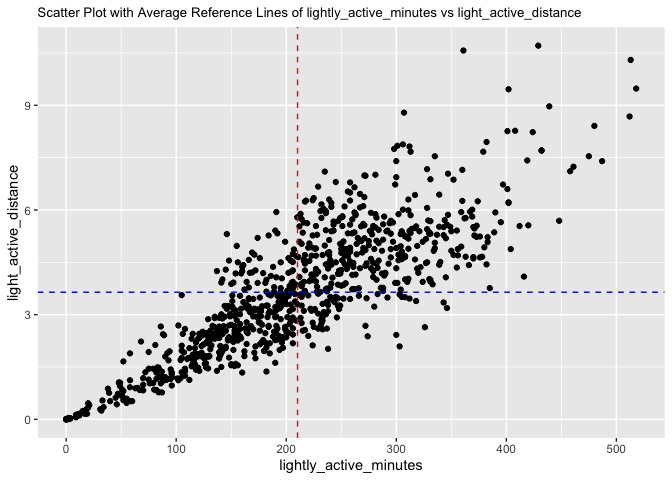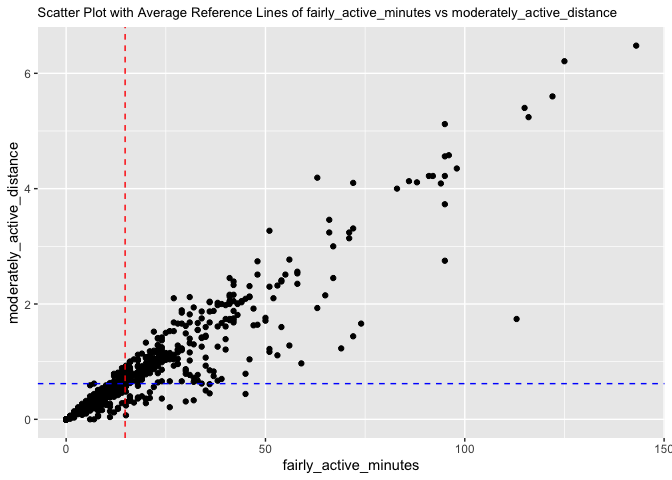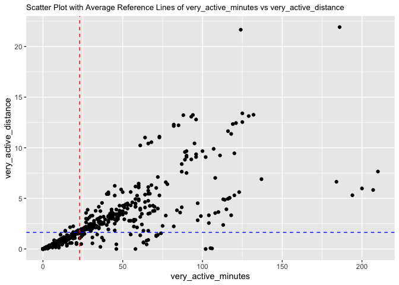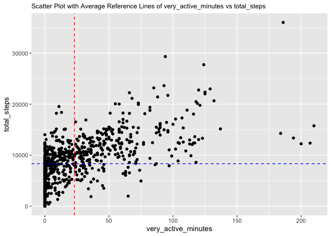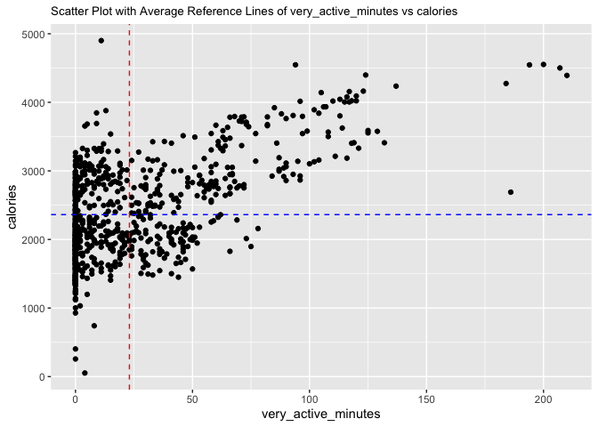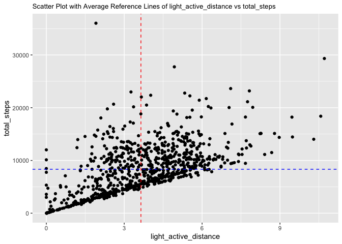

### User Behavior for the daily activity dataset

#### Total steps: Total number of steps taken.

``` r
# Create a boxplot for total_steps
boxplot(daily_activity_clean$total_steps, 
        main = "Boxplot of Total Steps",
        ylab = "Total Steps")

# Calculate the median and standard deviation
median_value <- median(daily_activity_clean$total_steps)
std_dev <- round(sd(daily_activity_clean$total_steps),2)

# Identify outliers
outliers <- boxplot.stats(daily_activity_clean$total_steps)$out

# Count the number of outliers
num_outliers <- length(outliers)

# Create the legend label with median, standard deviation, and outlier count
legend_label <- paste("Median:", median_value, 
                      "\nStandard Deviation:", std_dev, 
                      "\nOutliers:", num_outliers)

# Add the legend with median, standard deviation, and outlier count
legend("topright", legend = legend_label, pch = "", col = "black", bty = "n", cex = 0.85)
```


``` r
# Steps averages by IDs
steps_df <- daily_activity_clean %>%
  group_by(id) %>%
  summarise(average_steps = mean(total_steps), median_steps =median(total_steps), n = n())

steps_df
```

    # A tibble: 33 × 4
       id         average_steps median_steps     n
       <chr>              <dbl>        <dbl> <int>
     1 1503960366        12521.       12438     30
     2 1624580081         5744.        4026     31
     3 1644430081         7283.        6684.    30
     4 1844505072         3999.        4036.    20
     5 1927972279         1671.        1675     17
     6 2022484408        11371.       11548     31
     7 2026352035         5567.        5528     31
     8 2320127002         4717.        5057     31
     9 2347167796         9520.        9781     18
    10 2873212765         7556.        7762     31
    # … with 23 more rows

``` r
# Calculate percentages for the average column
at_least_10k_avg <- sum(steps_df$average_steps >= 10000) / nrow(steps_df) * 100
between_5K_10K_avg <- sum(steps_df$average_steps >= 5000 & steps_df$average_steps < 10000) / nrow(steps_df) * 100
below_5k_avg <- sum(steps_df$average_steps < 5000) / nrow(steps_df) * 100

# Calculate percentages for the median column
at_least_10k_med <- sum(steps_df$median_steps >= 10000) / nrow(steps_df) * 100
between_5K_10K_med <- sum(steps_df$median_steps >= 5000 & steps_df$median_steps < 10000) / nrow(steps_df) * 100
below_5k_med <- sum(steps_df$median_steps < 5000) / nrow(steps_df) * 100

# Create a data frame for the steps categories
percentage_steps_df<- data.frame(
  Category = c("Below 5,000", "Between 5,000 and 10,000", "At least 10,000"),
  Percentage_Average = round(c(below_5k_avg, between_5K_10K_avg, at_least_10k_avg)),
  Percentage_Median = round(c(below_5k_med, between_5K_10K_med, at_least_10k_med)))
percentage_steps_df
```

                      Category Percentage_Average Percentage_Median
    1              Below 5,000                 21                21
    2 Between 5,000 and 10,000                 58                52
    3          At least 10,000                 21                27

``` r
# Convert Category to a factor with custom factor levels
percentage_steps_df$Category <- factor(percentage_steps_df$Category, levels = c("Below 5,000", "Between 5,000 and 10,000", "At least 10,000"))

# Create a bar plot using ggplot
ggplot(percentage_steps_df, aes(x = Category, y = Percentage_Average)) +
  geom_bar(stat = "identity", fill = "blue") +
  labs(x = "Average Total Steps", y = "Percentage of Users", title = "58% of Users Average 5,000-10,000 Step Daily",subtitle = "Only 21% Achieve the 10,000-Step Goal") +
  geom_text(aes(label = paste0(Percentage_Average, "%")), vjust = -0.5, color = "black") + 
  ylim(0, 100) +  theme_minimal() + theme(panel.grid = element_blank())
```

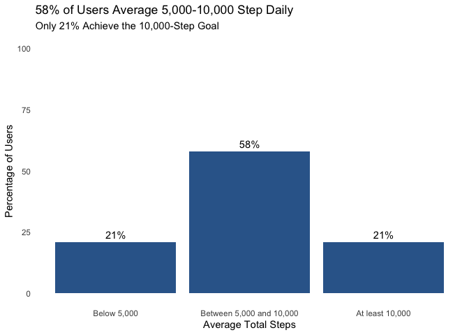

#### Total Distance: Total kilometers tracked.

``` r
# Create a boxplot for total_distance
boxplot(daily_activity_clean$total_distance, 
        main = "Boxplot of Total Distance",
        ylab = "Total Distance")

# Calculate the median and standard deviation
median_value <- median(daily_activity_clean$total_distance)
std_dev <- sd(daily_activity_clean$total_distance)

# Identify outliers
outliers <- boxplot.stats(daily_activity_clean$total_distance)$out

# Count the number of outliers
num_outliers <- length(outliers)

# Create the legend label with median, standard deviation, and outlier count
legend_label <- paste("Median:", round(median_value, 2), 
                      "\nStandard Deviation:", round(std_dev, 2), 
                      "\nOutliers:", num_outliers)

# Add the legend with median, standard deviation, and outlier count
legend("topright", legend = legend_label, pch = "", col = "black", bty = "n")
```


``` r
# Total distance by IDs
t_distance_df <- daily_activity_clean %>%
  group_by(id) %>%
  summarise(average_t_distance = mean(total_distance ), median_t_distance =median(total_distance), n = n())

t_distance_df
```

    # A tibble: 33 × 4
       id         average_t_distance median_t_distance     n
       <chr>                   <dbl>             <dbl> <int>
     1 1503960366               8.07              8.08    30
     2 1624580081               3.91              2.62    31
     3 1644430081               5.30              4.86    30
     4 1844505072               2.64              2.68    20
     5 1927972279               1.16              1.16    17
     6 2022484408               8.08              8.29    31
     7 2026352035               3.45              3.45    31
     8 2320127002               3.19              3.41    31
     9 2347167796               6.36              6.54    18
    10 2873212765               5.10              5.24    31
    # … with 23 more rows

``` r
# Calculate percentages for the average column
at_least_10_avg<- sum(t_distance_df$average_t_distance>= 10) / nrow(t_distance_df) * 100
between_5_10_avg <- sum(t_distance_df$average_t_distance >= 5 & t_distance_df$average_t_distance < 10) / nrow(t_distance_df) * 100
below_5_avg <- sum(t_distance_df$average_t_distance < 5) / nrow(t_distance_df) * 100

# Create a data frame for the distance categories
percentage_t_distance_df<- data.frame(
  Category = c("Below 5 km", "Between 5 and 10 km", "At least 10 km"),
  Percentage_Average = round(c(below_5_avg, between_5_10_avg , at_least_10_avg)))
percentage_t_distance_df
```

                 Category Percentage_Average
    1          Below 5 km                 39
    2 Between 5 and 10 km                 55
    3      At least 10 km                  6

``` r
# Convert Category to a factor with custom factor levels
percentage_t_distance_df$Category <- factor(percentage_t_distance_df$Category, levels = c("Below 5 km", "Between 5 and 10 km", "At least 10 km"))
```

``` r
# Create a bar plot using ggplot
ggplot(percentage_t_distance_df, aes(x = Category, y = Percentage_Average)) +
  geom_bar(stat = "identity", fill = "pink") +
  labs(x = "Average Total Distance", y = "Percentage of Users", title = "55% of Users Average 5-10 Kilometers Daily",subtitle = "10,000 steps is approximately equal to covering 5 miles (or 8 kilometers)") +
  geom_text(aes(label = paste0(Percentage_Average, "%")), vjust = -0.5, color = "black") + 
  ylim(0, 100) +  theme_minimal() +theme(panel.grid = element_blank())
```

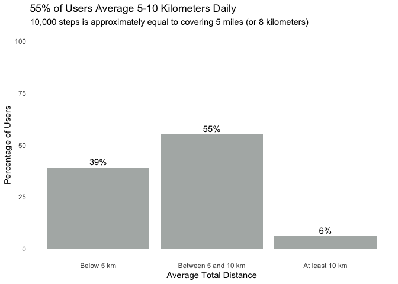

#### Sedentary Minutes: Total minutes spent in sedentary activity.

``` r
# Create a boxplot for sedentary_minutes
boxplot(daily_activity_clean$sedentary_minutes,
        main = "Boxplot of Sedentary Minutes",
        ylab = "Sedentary Minutes")

# Calculate the median and standard deviation
median_value <- median(daily_activity_clean$sedentary_minutes)
std_dev <- sd(daily_activity_clean$sedentary_minutes)

# Identify outliers
outliers <- boxplot.stats(daily_activity_clean$sedentary_minutes)$out

# Count the number of outliers
num_outliers <- length(outliers)

# Create the legend label with median, standard deviation, and outlier count
legend_label <- paste("Median:", round(median_value, 2),
                      "\nStandard Deviation:", round(std_dev, 2),
                      "\nOutliers:", num_outliers)

# Add the legend with median, standard deviation, and outlier count
legend("topright", legend = legend_label, pch = "", col = "black", bty = "n", cex = 0.80)
```


- These are high values for sedentary minutes. For instance, 1020
  minutes is equivalent to 17 hours, and 1400 minutes is equivalent to
  24 hours. After performing a quick search, it seems that the [Fitbit
  uses
  1400](https://community.fitbit.com/t5/Other-Charge-Trackers/sedentary-minutes/td-p/3372621)
  as default for sedentary minutes when the device is not worn and it
  includes the sleeping time.

SedentaryMinutes is total minutes spent in sedentary activity according
to the data dictionary. See meta data section. Therefore, we need to
substract the times sleeping to obtain an more accurate estimate of
daily sedentary minutes.

“Sleep time is not considered sedentary time, so it was removed to
determine the waking day and to allow the proportion of the day spent
sedentary to be calculated.”
[1](https://www.mdpi.com/1660-4601/18/8/3914)

``` r
# Check sedentary_minutes stats
daily_activity_clean$sedentary_minutes %>% summary()
```

       Min. 1st Qu.  Median    Mean 3rd Qu.    Max. 
        0.0   721.2  1020.5   955.2  1189.0  1440.0 

``` r
outliers
```

    [1]  2 13  0

``` r
# Count entries where sedentary minutes equal 1440
count_1440 <- sum(daily_activity_clean$sedentary_minutes == 1440)

# Output the count
count_1440
```

    [1] 7

``` r
# Remove rows with sedentary minutes equal to the default value (1440) and outliers

daily_activity_clean <- filter(daily_activity_clean, !(sedentary_minutes %in% c(0, 2, 13, 1440)))
```

``` r
# Rename the column
daily_sleep_clean <- rename(daily_sleep_clean, activity_date = sleep_day)

# Join the datasets
joined_activity_sleep <- inner_join(daily_activity_clean, daily_sleep_clean, by = c("id", "activity_date"))


# Check missing values and duplicates
cat(
  "\n",
  "Missing values:",
  sum(is.na(joined_activity_sleep )),
  "\n",
  "Duplicate values:",
  sum(duplicated(joined_activity_sleep )),
  "\n",
  "Unique Ids:",
  n_distinct(joined_activity_sleep $id)
)
```


     Missing values: 0 
     Duplicate values: 0 
     Unique Ids: 24

``` r
# Create a derived column for sedentary minutes that does not include sleep time
joined_activity_sleep <- joined_activity_sleep %>%
  mutate(
    sedentary_min_awake = sedentary_minutes - total_minutes_asleep,
    sedentary_hours_awake = sedentary_min_awake / 60,
    sedentary_percentage_diff = (sedentary_minutes - sedentary_min_awake) / sedentary_minutes * 100
  )
```

``` r
# Let us check the percentage difference of sedentary_minutes and the new column "sedentary_min_awake

# Create a boxplot for sedentary_percentage_diff
boxplot(joined_activity_sleep$sedentary_percentage_diff,
        main = "Boxplot of Sedentary Percentage Difference",
        ylab = "Sedentary Percentage Difference")

# Calculate the median and standard deviation
median_value <- median(joined_activity_sleep$sedentary_percentage_diff)
std_dev <- sd(joined_activity_sleep$sedentary_percentage_diff)

# Identify outliers
outliers <- boxplot.stats(joined_activity_sleep$sedentary_percentage_diff)$out

# Count the number of outliers
num_outliers <- length(outliers)

# Create the legend label with median, standard deviation, and outlier count
legend_label <- paste("Median:", round(median_value, 2),
                      "\nStandard Deviation:", round(std_dev, 2),
                      "\nOutliers:", num_outliers)

# Add the legend with median, standard deviation, and outlier count
legend("topright", legend = legend_label, pch = "", col = "black", bty = "n", cex = 0.80)
```


- The sedentary percentage difference has a median value of 59.95%,
  indicating a significant distinction between sedentary_minutes and
  sedentary_min_awake. This suggest that the original column
  “sedentary_minutes” included the time asleep.

``` r
# Create a boxplot for sedentary_min_awake
boxplot(joined_activity_sleep$sedentary_min_awake,
        main = "Boxplot of Sedentary Minutes Awake",
        ylab = "Sedentary Minutes Awake")

# Calculate the median and standard deviation
median_value <- median(joined_activity_sleep$sedentary_min_awake)
std_dev <- sd(joined_activity_sleep$sedentary_min_awake)

# Identify outliers
outliers <- boxplot.stats(joined_activity_sleep$sedentary_min_awake)$out

# Count the number of outliers
num_outliers <- length(outliers)

# Create the legend label with median, standard deviation, and outlier count
legend_label <- paste("Median:", round(median_value, 2),
                      "\nStandard Deviation:", round(std_dev, 2),
                      "\nOutliers:", num_outliers)

# Add the legend with median, standard deviation, and outlier count
legend("topright", legend = legend_label, pch = "", col = "black", bty = "n", cex = 0.80)
```

 -
Observation: There appears to be an inconsistency in the data. The
sedentary_minutes value is smaller than the total_minutes_asleep value,
which is unexpected.

``` r
# Count the number of cases where sedentary_minutes is smaller than total_minutes_asleep
count <- sum(joined_activity_sleep$sedentary_minutes < joined_activity_sleep$total_minutes_asleep)

# Print the count
count
```

    [1] 42

``` r
# Subset the dataset
subset_data <- joined_activity_sleep[joined_activity_sleep$sedentary_minutes < joined_activity_sleep$total_minutes_asleep, ]

# View the subset data
subset_data
```

    # A tibble: 42 × 21
       id         activity…¹ total…² total…³ track…⁴ logge…⁵ very_…⁶ moder…⁷ light…⁸
       <chr>      <date>       <dbl>   <dbl>   <dbl>   <dbl>   <dbl>   <dbl>   <dbl>
     1 1503960366 2016-04-17    9705   6.48    6.48        0  3.19     0.780   2.51 
     2 1503960366 2016-05-08   10060   6.58    6.58        0  3.53     0.320   2.73 
     3 1644430081 2016-05-02    3758   2.73    2.73        0  0.0700   0.310   2.35 
     4 1844505072 2016-04-15    3844   2.54    2.54        0  0        0       2.54 
     5 1844505072 2016-04-30    4014   2.67    2.67        0  0        0       2.65 
     6 1844505072 2016-05-01    2573   1.70    1.70        0  0        0.260   1.45 
     7 1927972279 2016-04-12     678   0.470   0.470       0  0        0       0.470
     8 2026352035 2016-04-23   12357   7.71    7.71        0  0        0       7.71 
     9 2026352035 2016-05-04    6564   4.07    4.07        0  0        0       4.07 
    10 2026352035 2016-05-06    8198   5.08    5.08        0  0        0       5.08 
    # … with 32 more rows, 12 more variables: sedentary_active_distance <dbl>,
    #   very_active_minutes <dbl>, fairly_active_minutes <dbl>,
    #   lightly_active_minutes <dbl>, sedentary_minutes <dbl>, calories <dbl>,
    #   total_sleep_records <dbl>, total_minutes_asleep <dbl>,
    #   total_time_in_bed <dbl>, sedentary_min_awake <dbl>,
    #   sedentary_hours_awake <dbl>, sedentary_percentage_diff <dbl>, and
    #   abbreviated variable names ¹​activity_date, ²​total_steps, ³​total_distance, …

``` r
# Check column names of the subset data
subset_data %>%
select(sedentary_minutes, total_minutes_asleep, sedentary_min_awake, calories,id, activity_date, total_steps, total_distance, very_active_minutes )
```

    # A tibble: 42 × 9
       sedentary_…¹ total…² seden…³ calor…⁴ id    activity…⁵ total…⁶ total…⁷ very_…⁸
              <dbl>   <dbl>   <dbl>   <dbl> <chr> <date>       <dbl>   <dbl>   <dbl>
     1          539     700    -161    1728 1503… 2016-04-17    9705   6.48       38
     2          574     594     -20    1740 1503… 2016-05-08   10060   6.58       44
     3          682     796    -114    2580 1644… 2016-05-02    3758   2.73        1
     4          527     644    -117    1725 1844… 2016-04-15    3844   2.54        0
     5          218     722    -504    1763 1844… 2016-04-30    4014   2.67        0
     6          585     590      -5    1541 1844… 2016-05-01    2573   1.70        0
     7          734     750     -16    2220 1927… 2016-04-12     678   0.470       0
     8          458     522     -64    1916 2026… 2016-04-23   12357   7.71        0
     9          530     538      -8    1658 2026… 2016-05-04    6564   4.07        0
    10          511     524     -13    1736 2026… 2016-05-06    8198   5.08        0
    # … with 32 more rows, and abbreviated variable names ¹​sedentary_minutes,
    #   ²​total_minutes_asleep, ³​sedentary_min_awake, ⁴​calories, ⁵​activity_date,
    #   ⁶​total_steps, ⁷​total_distance, ⁸​very_active_minutes

``` r
dim(subset_data)
```

    [1] 42 21

``` r
dim(joined_activity_sleep)
```

    [1] 408  21

``` r
# Use anti_join() to return a new dataset that includes all rows from the first dataset except for the rows that have a match in the second dataset.
 clean_subset<- anti_join(joined_activity_sleep, subset_data)
```

    Joining with `by = join_by(id, activity_date, total_steps, total_distance,
    tracker_distance, logged_activities_distance, very_active_distance,
    moderately_active_distance, light_active_distance, sedentary_active_distance,
    very_active_minutes, fairly_active_minutes, lightly_active_minutes,
    sedentary_minutes, calories, total_sleep_records, total_minutes_asleep,
    total_time_in_bed, sedentary_min_awake, sedentary_hours_awake,
    sedentary_percentage_diff)`

``` r
dim(clean_subset)
```

    [1] 366  21

``` r
# Create a boxplot for sedentary_min_awake
boxplot(clean_subset$sedentary_min_awake,
        main = "Boxplot of Sedentary Minutes Awake",
        ylab = "Sedentary Minutes Awake")

# Calculate the median and standard deviation
median_value <- median(clean_subset$sedentary_min_awake)
std_dev <- sd(clean_subset$sedentary_min_awake)

# Identify outliers
outliers <- boxplot.stats(clean_subset$sedentary_min_awake)$out

# Count the number of outliers
num_outliers <- length(outliers)

# Create the legend label with median, standard deviation, and outlier count
legend_label <- paste("Median:", round(median_value, 2),
                      "\nStandard Deviation:", round(std_dev, 2),
                      "\nOutliers:", num_outliers)

# Add the legend with median, standard deviation, and outlier count
legend("topright", legend = legend_label, pch = "", col = "black", bty = "n", cex = 0.80)
```


Observation:

- By eliminating negative values from “sedentary_min_awake,” the
  resulting values now reflect a more realistic scenario.

``` r
# Total sedentary minutes awake by IDs
t_sedentary_df <- clean_subset %>%
  group_by(id) %>%
  summarise(average_sedentary_min_awake = mean(sedentary_min_awake),
            median_sedentary_min_awake = median(sedentary_min_awake), n = n())

t_sedentary_df
```

    # A tibble: 23 × 4
       id         average_sedentary_min_awake median_sedentary_min_awake     n
       <chr>                            <dbl>                      <dbl> <int>
     1 1503960366                        442.                       433     23
     2 1644430081                        873.                       854      3
     3 1927972279                        704.                       675      4
     4 2026352035                        181.                       158     24
     5 2320127002                       1068                       1068      1
     6 2347167796                        245.                       220     13
     7 3977333714                        423.                       420     28
     8 4020332650                        492.                       440.     8
     9 4319703577                        209.                       148     23
    10 4388161847                        345                        294     23
    # … with 13 more rows

``` r
dataset <- t_sedentary_df
column <- "average_sedentary_min_awake"
new_categories <- c("Below 200 minutes", "Between 200 and 400 minutes", "At least 400 minutes")

# Calculate percentages for the average column
below_200_avg <- sum(dataset[[column]] < 200) / nrow(dataset) * 100
between_200_400_avg <- sum(dataset[[column]] >= 200 & dataset[[column]] <= 400) / nrow(dataset) * 100
at_least_400_avg <- sum(dataset[[column]] >= 400) / nrow(dataset) * 100

# Create a data frame for the categories
percentage_sedentary_awake_df <- data.frame(
  Category = new_categories,
  Percentage_Average = round(c(below_200_avg, between_200_400_avg, at_least_400_avg))
)

# Convert Category to a factor with custom factor levels
percentage_sedentary_awake_df$Category <- factor(percentage_sedentary_awake_df$Category, levels = new_categories)

percentage_sedentary_awake_df
```

                         Category Percentage_Average
    1           Below 200 minutes                  9
    2 Between 200 and 400 minutes                 43
    3        At least 400 minutes                 48

``` r
# Create a bar plot using ggplot
ggplot(percentage_sedentary_awake_df, aes(x = Category, y = Percentage_Average)) +
  geom_bar(stat = "identity", fill = "gray") +
  labs(x = "Average Total Sedentary Min Awake", y = "Percentage of Users", 
       title = "48% of Users Have an Average of at Least 400 Daily Sedentary Minutes While Awake",
       subtitle = "200 Minutes are 3 hours and 20 minutes; 400 min are 6 hours and 40 min") +
  geom_text(aes(label = paste0(Percentage_Average, "%")), vjust = -0.5, color = "black") + 
  ylim(0, 100) +
  theme_minimal() +
  theme(panel.grid = element_blank(), plot.title = element_text(size = 12), plot.subtitle = element_text(size = 10))
```

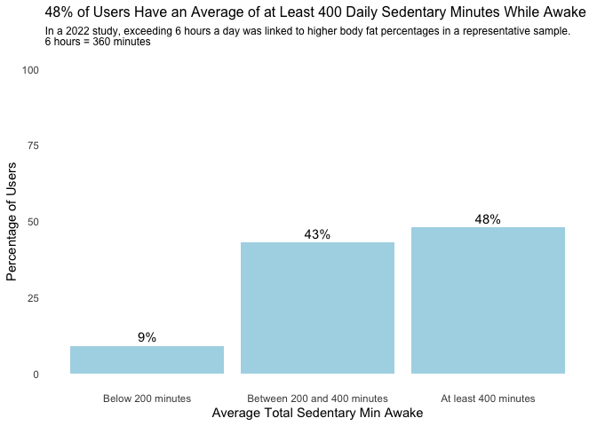

In a representative sample of U.S. adults, over two-thirds spent 6 +
hours/day sitting, and more than half did not meet the recommended 150
min/week of physical activity. The study discovered that prolonged
sitting for 6+ hours/day was associated with higher body fat
percentages. While exceeding 150 min/week of physical activity was
linked to lower body fat percentages, achieving recommended activity
levels may not fully offset the increased body fat from prolonged
sitting
[2](https://www.sciencedirect.com/science/article/pii/S2095254622001016).

#### Calories:Total estimated energy expenditure (in kilocalories).

``` r
# Create a boxplot for calories
boxplot(daily_activity_clean$calories, 
        main = "Boxplot of Calories",
        ylab = "Calories")

# Calculate the median and standard deviation
median_value <- median(daily_activity_clean$calories)
std_dev <- round(sd(daily_activity_clean$calories),2)

# Identify outliers
outliers <- boxplot.stats(daily_activity_clean$calories)$out

# Count the number of outliers
num_outliers <- length(outliers)

# Create the legend label with median, standard deviation, and outlier count
legend_label <- paste("Median:", median_value, 
                      "\nStandard Deviation:", std_dev, 
                      "\nOutliers:", num_outliers)

# Add the legend with median, standard deviation, and outlier count
legend("topright", legend = legend_label, pch = "", col = "black", bty = "n", cex = 0.85)
```


``` r
outliers
```

    [1] 4552 4392 4501 4546 4900 4547 4398

``` r
# Calories averages by IDs
calories_df <- daily_activity_clean %>%
  group_by(id) %>%
  summarise(average_calories = mean(calories), median_calories = median(calories))

calories_df
```

    # A tibble: 33 × 3
       id         average_calories median_calories
       <chr>                 <dbl>           <dbl>
     1 1503960366            1877.           1848 
     2 1624580081            1483.           1435 
     3 1644430081            2811.           2802.
     4 1844505072            1732.           1752.
     5 1927972279            2303.           2324 
     6 2022484408            2510.           2529 
     7 2026352035            1541.           1521 
     8 2320127002            1724.           1779 
     9 2347167796            2140.           2095 
    10 2873212765            1917.           1907 
    # … with 23 more rows

``` r
# Calculate percentages for the average column
below_1600_avg <- sum(calories_df$average_calories < 1600) / nrow(calories_df) * 100
between_1600_2200_avg <- sum(calories_df$average_calories >= 1600 & calories_df$average_calories < 2200) / nrow(calories_df) * 100
between_2200_3000_avg <- sum(calories_df$average_calories >= 2200 & calories_df$average_calories < 3000) / nrow(calories_df) * 100
at_least_3000_avg <- sum(calories_df$average_calories >= 3000) / nrow(calories_df) * 100

# Calculate percentages for the median column
below_1600_med <- sum(calories_df$median_calories < 1600) / nrow(calories_df) * 100
between_1600_2200_med <- sum(calories_df$median_calories >= 1600 & calories_df$median_calories < 2200) / nrow(calories_df) * 100
between_2200_3000_med <- sum(calories_df$median_calories >= 2200 & calories_df$median_calories < 3000) / nrow(calories_df) * 100
at_least_3000_med <- sum(calories_df$median_calories >= 3000) / nrow(calories_df) * 100

# Create a data frame for the calories categories
percentage_calories_df <- data.frame(
  Category = c("Below 1,600", "Between 1,600 and 2,200", "Between 2,200 and 3,000", "At least 3,000"),
  Percentage_Average = round(c(below_1600_avg, between_1600_2200_avg, between_2200_3000_avg, at_least_3000_avg)),
  Percentage_Median = round(c(below_1600_med, between_1600_2200_med, between_2200_3000_med, at_least_3000_med))
)

# Convert Category to a factor with custom factor levels
percentage_calories_df$Category <- factor(percentage_calories_df$Category, levels = c("Below 1,600", "Between 1,600 and 2,200", "Between 2,200 and 3,000", "At least 3,000"))

percentage_calories_df
```

                     Category Percentage_Average Percentage_Median
    1             Below 1,600                  9                 9
    2 Between 1,600 and 2,200                 42                36
    3 Between 2,200 and 3,000                 36                36
    4          At least 3,000                 12                18

``` r
# Create a bar plot using ggplot
ggplot(percentage_calories_df, aes(x = Category, y = Percentage_Average)) +
  geom_bar(stat = "identity", fill = "red") +
  labs(x = "Calorie Categories", y = "Percentage of Users", 
       title = "42% of Users Have an Average Daily Calorie Expenditure Between 1,600 and 2,200.",
       subtitle = "Most females require 1,600 to 2,200 calories per day, as per the Dietary Guidelines for Americans, 2020-2025") +
  geom_text(aes(label = paste0(Percentage_Average, "%")), vjust = -0.5, color = "black") + 
  ylim(0, 100) +
  theme_minimal() +
  theme(panel.grid = element_blank(), 
        plot.title = element_text(size = 12), 
        plot.subtitle = element_text(size = 10))
```

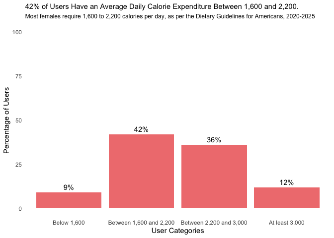

“Females ages 19 through 30 require about 1,800 to 2,400 calories a day.
Males in this age group have higher calorie needs of about 2,400 to
3,000 a day. Calorie needs for adults ages 31 through 59 are generally
lower; most females require about 1,600 to 2,200 calories a day and
males require about 2,200 to 3,000 calories a
day.”[3](https://www.dietaryguidelines.gov/)

#### Intensity Minutes: Time spent in one of four intensity categories.

- VeryActiveMinutes: Total minutes spent in very active activity

- FairlyActiveMinutes: Total minutes spent in moderate activity

- LightlyActiveMinutes: Total minutes spent in light activity

- SedentaryMinutes: Total minutes spent in sedentary activity

``` r
activity_minutes_df <- daily_activity_clean %>%
  group_by(id) %>%
  summarise(
    average_very_active_minutes = mean(very_active_minutes),
    average_fairly_active_minutes = mean(fairly_active_minutes),
    average_lightly_active_minutes = mean(lightly_active_minutes),
    average_sedentary_minutes = mean(sedentary_minutes)
  )

activity_minutes_df
```

    # A tibble: 33 × 5
       id         average_very_active_minutes average_fairly_activ…¹ avera…² avera…³
       <chr>                            <dbl>                  <dbl>   <dbl>   <dbl>
     1 1503960366                     40                      19.8     227.     828.
     2 1624580081                      8.68                    5.81    153.    1258.
     3 1644430081                      9.57                   21.4     178.    1162.
     4 1844505072                      0.2                     2       179.    1115.
     5 1927972279                      2.41                    1.41     70.4   1244.
     6 2022484408                     36.3                    19.4     257.    1113.
     7 2026352035                      0.0968                  0.258   257.     689.
     8 2320127002                      1.35                    2.58    198.    1220.
     9 2347167796                     14.3                    21.8     267.     727.
    10 2873212765                     14.1                     6.13    308     1097.
    # … with 23 more rows, and abbreviated variable names
    #   ¹​average_fairly_active_minutes, ²​average_lightly_active_minutes,
    #   ³​average_sedentary_minutes

``` r
# Define the custom order of legend items
custom_order <- c( "Very Active", "Fairly Active", "Lightly Active", "Sedentary")

# Create the stacked bar plot
ggplot(activity_minutes_df, aes(y = id)) +
  geom_bar(aes(x = average_sedentary_minutes, fill = "Sedentary"), stat = "identity", width = 0.5) +
  geom_bar(aes(x = average_lightly_active_minutes, fill = "Lightly Active"), stat = "identity", width = 0.5) +
  geom_bar(aes(x = average_fairly_active_minutes, fill = "Fairly Active"), stat = "identity", width = 0.5) +
  geom_bar(aes(x = average_very_active_minutes, fill = "Very Active"), stat = "identity", width = 0.5) +
  xlab("Minutes") +
  ylab("ID") +
  ggtitle("Average Activity Minutes by ID") +
  scale_fill_manual(name = "", values = c("Very Active" = "red", "Fairly Active" = "orange", "Lightly Active" = "lightgreen", "Sedentary" = "lightblue"), breaks = custom_order) +
  theme_minimal() +
  theme(legend.position = "bottom", panel.grid = element_blank()) 
```


``` r
# Calculate the average for each column
averages <- colMeans(activity_minutes_df[, c("average_very_active_minutes",
                                             "average_fairly_active_minutes",
                                             "average_lightly_active_minutes",
                                             "average_sedentary_minutes")])

# Calculate the total average
total_average <- sum(averages)

# Calculate the proportions
proportions <- averages / total_average

# Create the new dataframe with modified row names
overall_average_df<- data.frame(Average = averages,
                     Percentage = proportions * 100)

# Modify the row names
row_names <- c("Very Active", "Fairly Active", "Lightly Active", "Sedentary")
row.names(overall_average_df) <- row_names

# Print the new dataframe
overall_average_df
```

                     Average Percentage
    Very Active     21.18923   1.744450
    Fairly Active   14.29851   1.177156
    Lightly Active 206.97366  17.039558
    Sedentary      972.20431  80.038837

``` r
ggplot(overall_average_df, aes(x = Percentage, y = reorder(row.names(overall_average_df), Percentage), fill = row.names(overall_average_df))) +
  geom_bar(stat = "identity", width = 0.7, show.legend = FALSE) +
  geom_text(aes(label = paste0(round(Percentage), "%")), hjust = -0.2, color = "black", size = 4) +
  ylab("Minutes Intensity") +
  xlab("Percentage") +
  ggtitle("Users' Overall Average Intensity Minutes Consist Primarily of Sedentary and Lightly Active Time") +
  scale_fill_manual(values = c("Very Active" = "red", "Fairly Active" = "orange", "Lightly Active" = "lightgreen", "Sedentary" = "lightblue")) +
 scale_x_continuous(labels = NULL) +
  theme_minimal() +
  theme(legend.position = "none", panel.grid = element_blank(), axis.text.y = element_text(size = 10))
```


``` r
# Define the custom order of legend items

custom_order <- c("Very Active", "Fairly Active", "Lightly Active", "Sedentary")


# Create the stacked horizontal bar chart
ggplot(overall_average_df, aes(x = Percentage, y = factor(1), fill = factor(row.names(overall_average_df), levels = custom_order))) +
  geom_bar(stat = "identity", width = 0.7) +
  xlab("Percentage") +
  ylab("") +
  ggtitle("Users' Overall Average Intensity Minutes Consist Primarily of Sedentary and Lightly Active Time") +
  scale_fill_manual(
    name = "",
    values = c(
      "Very Active" = "red",
      "Fairly Active" = "orange",
      "Lightly Active" = "lightgreen",
      "Sedentary" = "lightblue"
    ),
    breaks = custom_order
  ) +
  guides(fill = guide_legend(reverse = TRUE)) +  # Reverse the order of the legend
  theme_minimal() +
  theme(legend.position = "top", 
        panel.grid = element_blank(),
         axis.text.y = element_blank(),  # Remove the y-axis text
         plot.title = element_text(size = 12, margin = margin(b = 20))) + # Adjust the title size and margin
  geom_vline(xintercept = 97, color = "black", linetype = "dashed") +
  annotate("text", x = 97, y = 1, label = "   97%", vjust = -5.5, hjust = 0.1)
```


Observations:

- Users’ overall average intensity minutes consist primarily of
  sedentary and lightly active time, comprising 97%.

- We can use average user activity pattern to develop indicators to
  provide insights into activity levels. They can help track progress,
  set goals, and evaluate user behavior over time.

- This is a concern since the Physical Activity Guidelines for Americans
  recommend 150 minutes of moderate-intensity or 75 minutes of
  vigorous-intensity aerobic activity weekly, along with
  muscle-strengthening exercises for adults. Additionally, it’s advised
  to reduce sedentary time and break up long periods of
  inactivity.[4](https://health.gov/sites/default/files/2019-09/Physical_Activity_Guidelines_2nd_edition.pdf)

## EDA for daily_sleep_clean

``` r
str(daily_sleep_clean)
```

    tibble [410 × 5] (S3: tbl_df/tbl/data.frame)
     $ id                  : chr [1:410] "1503960366" "1503960366" "1503960366" "1503960366" ...
     $ activity_date       : Date[1:410], format: "2016-04-12" "2016-04-13" ...
     $ total_sleep_records : num [1:410] 1 2 1 2 1 1 1 1 1 1 ...
     $ total_minutes_asleep: num [1:410] 327 384 412 340 700 304 360 325 361 430 ...
     $ total_time_in_bed   : num [1:410] 346 407 442 367 712 320 377 364 384 449 ...

- activity_date (sleep_day): Date on which the sleep event started.

- total_sleep_records: Number of recorded sleep periods for that day.
  Includes naps \> 60 min.

- total_minutes_asleep: Total number of minutes classified as being
  “asleep”.

- total_time_in_bed: Total minutes spent in bed, including asleep,
  restless, and awake, that occurred during a defined sleep record.

``` r
#Sanity check: Verify that the value of total_time_in_bed is greater than total_minutes_asleep, as we would expect.
daily_sleep_clean[daily_sleep_clean$total_time_in_bed < daily_sleep_clean$total_minutes_asleep,]
```

    # A tibble: 0 × 5
    # … with 5 variables: id <chr>, activity_date <date>,
    #   total_sleep_records <dbl>, total_minutes_asleep <dbl>,
    #   total_time_in_bed <dbl>

### Univariate analysis

``` r
numerical_cols <- daily_sleep_clean%>%
  select_if(is.numeric)

# plotting all numerical variables
col_names <- colnames(numerical_cols )
for (i in col_names) {
  suppressWarnings(print(
    ggplot(numerical_cols , aes(numerical_cols [[i]])) +
      geom_histogram(
        bins = 30,
        color = "black",
        fill = "gray",
        aes(y = ..density..)
      ) +
      geom_density(
        color = "blue",
        size = 1
      ) +
      xlab(i) + ylab("Count") +
      ggtitle(paste("Histogram with Density Plot of", i))
  ))
}
```


### Bivariate analysis

#### Correlation between numerical variables

``` r
# Correlation between numerical variables
corr <- cor(select_if(daily_sleep_clean, is.numeric))

ggcorrplot(corr,
           hc.order = TRUE,
           type = "lower",
           lab = TRUE,
           colors = c("firebrick", "white", "royalblue"),
           lab_size = 4,
           lab_col = "black",
           title = "Correlation Between Numerical Variables")
```


#### Scatterplots of total_minutes_asleep vs total_time_in_bed

``` r
ggplot(data = daily_sleep_clean, aes(x = total_minutes_asleep, y = total_time_in_bed)) +
  geom_point()
```


### User Behavior for daily sleep dataset

``` r
frequency_table <- as.data.frame(table(daily_sleep_clean$total_sleep_records))
frequency_table$Percentage <- frequency_table$Freq / sum(frequency_table$Freq) * 100

ggplot(data = frequency_table, aes(x = Var1, y = Freq)) +
  geom_bar(stat = "identity", fill = "steelblue") +
  geom_text(aes(label = paste(Freq, " (", percent(Percentage / 100), ")", sep = "")),
            hjust = 0.5,  vjust = -0.4, color = "black") +
  labs(x = "Total Sleep Records", y = "Frequency",
       title = "Uncommon Napping: 89% of Sleep Records Indicate a Singular Sleep Period.",
       subtitle = "Includes naps > 60 min.")+
  theme_minimal() +
  theme(panel.grid = element_blank(),
        plot.title = element_text(size = 12),
        plot.subtitle = element_text(size = 10, margin = margin(b = 20)))
```


#### Total minutes asleep

``` r
# Create a boxplot for total_minutes_asleep
boxplot(daily_sleep_clean$total_minutes_asleep, 
        main = "Boxplot of Total Minutes Asleep",
        ylab = "Total Minutes Asleep")

# Calculate the median and standard deviation
median_value <- median(daily_sleep_clean$total_minutes_asleep)
std_dev <- round(sd(daily_sleep_clean$total_minutes_asleep), 2)

# Identify outliers
outliers <- boxplot.stats(daily_sleep_clean$total_minutes_asleep)$out

# Count the number of outliers
num_outliers <- length(outliers)

# Create the legend label with median, standard deviation, and outlier count
legend_label <- paste("Median:", median_value, 
                      "\nStandard Deviation:", std_dev, 
                      "\nOutliers:", num_outliers)

# Add the legend with median, standard deviation, and outlier count
legend("topright", legend = legend_label, pch = "", col = "black", bty = "n", cex = 0.85)
```


``` r
# Sleep duration averages by IDs with standard deviation and count (n)
sleep_df <- daily_sleep_clean %>%
  group_by(id) %>%
  summarise(average_sleep_minutes = mean(total_minutes_asleep),
            standard_deviation_sleep_minutes = sd(total_minutes_asleep),
            n = n())

sleep_df
```

    # A tibble: 24 × 4
       id         average_sleep_minutes standard_deviation_sleep_minutes     n
       <chr>                      <dbl>                            <dbl> <int>
     1 1503960366                  360.                            100.     25
     2 1644430081                  294                             335.      4
     3 1844505072                  652                              66.4     3
     4 1927972279                  417                             219.      5
     5 2026352035                  506.                             42.3    28
     6 2320127002                   61                              NA       1
     7 2347167796                  447.                             43.0    15
     8 3977333714                  294.                             63.9    28
     9 4020332650                  349.                            141.      8
    10 4319703577                  477.                            114.     26
    # … with 14 more rows

``` r
# Drop ID "2320127002" due to insufficient data for computing mean and standard deviation.
sleep_df <- sleep_df %>% 
filter(id != "2320127002")
```

``` r
sleep_df 
```

    # A tibble: 23 × 4
       id         average_sleep_minutes standard_deviation_sleep_minutes     n
       <chr>                      <dbl>                            <dbl> <int>
     1 1503960366                  360.                            100.     25
     2 1644430081                  294                             335.      4
     3 1844505072                  652                              66.4     3
     4 1927972279                  417                             219.      5
     5 2026352035                  506.                             42.3    28
     6 2347167796                  447.                             43.0    15
     7 3977333714                  294.                             63.9    28
     8 4020332650                  349.                            141.      8
     9 4319703577                  477.                            114.     26
    10 4388161847                  400.                            146.     23
    # … with 13 more rows

``` r
# Calculate percentages for the average column
below_6_hours <- sum(sleep_df$average_sleep_minutes < 360) / nrow(sleep_df) * 100
between_6_7_hours <- sum(sleep_df$average_sleep_minutes >= 360 & sleep_df$average_sleep_minutes < 420) / nrow(sleep_df) * 100
at_least_7_hours <- sum(sleep_df$average_sleep_minutes >= 420) / nrow(sleep_df) * 100

# Create a data frame for the sleep duration categories
percentage_sleep_df <- data.frame(
  Category = c("Below 6 hours", "Between 6 and 7 hours", "At least 7 hours"),
  Percentage_Average = round(c(below_6_hours, between_6_7_hours, at_least_7_hours))
)

# Convert Category to a factor with custom factor levels
percentage_sleep_df$Category <- factor(percentage_sleep_df$Category, levels = c("Below 6 hours", "Between 6 and 7 hours", "At least 7 hours"))

percentage_sleep_df
```

                   Category Percentage_Average
    1         Below 6 hours                 30
    2 Between 6 and 7 hours                 22
    3      At least 7 hours                 48

``` r
str(percentage_sleep_df)
```

    'data.frame':   3 obs. of  2 variables:
     $ Category          : Factor w/ 3 levels "Below 6 hours",..: 1 2 3
     $ Percentage_Average: num  30 22 48

``` r
ggplot(percentage_sleep_df, aes(x = Category, y = Percentage_Average)) +
  geom_bar(stat = "identity", fill = "purple") +
  labs(x = "Average Sleep Duration", y = "Percentage of Users", 
       title = "52% of Users Get Less Than 7 Hours of Sleep on Average Daily") +
  geom_text(aes(label = paste0(Percentage_Average, "%")), vjust = -0.5, color = "black") + 
  ylim(0, 100) +
  theme_minimal() +
  theme(panel.grid = element_blank(), plot.title = element_text(size = 12), plot.subtitle = element_text(size = 10))
```


#### Sleep duration consistency

``` r
#Error bars

# Convert average_sleep_minutes and standard_deviation_sleep_minutes to hours
sleep_df$average_sleep_hours <- sleep_df$average_sleep_minutes / 60
sleep_df$standard_deviation_sleep_hours <- sleep_df$standard_deviation_sleep_minutes / 60


# Create a bar plot for each 'id' with error bars representing standard deviation
ggplot(sleep_df, aes(x = id, y = average_sleep_hours)) +
  geom_bar(stat = "identity", fill = "skyblue", color = "black") +
  geom_errorbar(aes(ymin = average_sleep_hours - standard_deviation_sleep_minutes / 60,
                    ymax = average_sleep_hours + standard_deviation_sleep_minutes / 60),
                width = 0.2, position = position_dodge(0.9), color = "black") +
  labs(x = "ID", y = "Average Sleep Duration (hours)",
       title = "Sleep Consistency: Average Sleep Duration with Error Bars",
       subtitle = "Error bars represent the standard deviation around the mean.") +
  theme_minimal() +
  theme(axis.text.x = element_text(angle = 45, hjust = 1)) +
  geom_hline(yintercept = 7, linetype = "dashed", color = "red") +
  scale_y_continuous(breaks = seq(0, 12, 1))  # Adjust the range as needed
```


``` r
# Calculate sleep duration averages and standard deviations in hours
sleep_df <- daily_sleep_clean %>%
  group_by(id) %>%
  summarise(n = n(),
            average_sleep_hours = mean(total_minutes_asleep) / 60,       # Convert minutes to hours
            average_time_in_bed_hours = mean(total_time_in_bed) / 60,   
            standard_deviation_sleep_hours = sd(total_minutes_asleep) / 60,     
            standard_deviation_time_in_bed_hours = sd(total_time_in_bed) / 60,    
           ) %>%
  mutate(time_difference_hours = average_time_in_bed_hours - average_sleep_hours,  # Calculate the time difference in hours
         average_awake_in_bed_hours = time_difference_hours,  # Rename column "awake_in_bed"
         sd_awake_in_bed_hours = sd(time_difference_hours))  # Calculate SD for "awake_in_bed" in hours


sleep_df
```

    # A tibble: 24 × 9
       id             n average_sl…¹ avera…² stand…³ stand…⁴ time_…⁵ avera…⁶ sd_aw…⁷
       <chr>      <int>        <dbl>   <dbl>   <dbl>   <dbl>   <dbl>   <dbl>   <dbl>
     1 1503960366    25         6.00    6.39   1.67    1.63    0.382   0.382    1.08
     2 1644430081     4         4.9     5.77   5.58    6.84    0.867   0.867    1.08
     3 1844505072     3        10.9    16.0    1.11    0       5.15    5.15     1.08
     4 1927972279     5         6.95    7.30   3.65    3.73    0.347   0.347    1.08
     5 2026352035    28         8.44    8.96   0.704   0.707   0.524   0.524    1.08
     6 2320127002     1         1.02    1.15  NA      NA       0.133   0.133    1.08
     7 2347167796    15         7.45    8.19   0.716   0.827   0.742   0.742    1.08
     8 3977333714    28         4.89    7.69   1.07    1.24    2.79    2.79     1.08
     9 4020332650     8         5.82    6.33   2.35    2.64    0.506   0.506    1.08
    10 4319703577    26         7.94    8.37   1.90    1.97    0.422   0.422    1.08
    # … with 14 more rows, and abbreviated variable names ¹​average_sleep_hours,
    #   ²​average_time_in_bed_hours, ³​standard_deviation_sleep_hours,
    #   ⁴​standard_deviation_time_in_bed_hours, ⁵​time_difference_hours,
    #   ⁶​average_awake_in_bed_hours, ⁷​sd_awake_in_bed_hours

``` r
# Drop ID "2320127002" due to insufficient data for computing mean and standard deviation.
sleep_df <- sleep_df %>% 
filter(id != "2320127002")
dim(sleep_df)
```

    [1] 23  9

``` r
create_boxplots_in_one_output <- function(data_frame, columns_to_analyze, decimal_places = 2) {
  num_columns <- length(columns_to_analyze)
  num_rows <- ceiling(num_columns / 2)
  
  par(mfrow = c(num_rows, 2))  # Set the plotting layout
  
  for (i in 1:num_columns) {
    column_name <- columns_to_analyze[i]
    boxplot(data_frame[[column_name]],
            ylab = column_name)
    
    median_value <- median(data_frame[[column_name]])
    std_dev <- round(sd(data_frame[[column_name]]), decimal_places)
    outliers <- boxplot.stats(data_frame[[column_name]])$out
    num_outliers <- length(outliers)
    
    legend_label <- paste("Median:", round(median_value, decimal_places),
                          "\nSD:", std_dev,
                          "\nOutliers:", num_outliers)
    
    legend("topright", legend = legend_label, pch = "", col = "black", bty = "n", cex = 0.75)
  }
  
  par(mfrow = c(1, 1))  # Reset the plotting layout to default
}

# Columns to analyze
columns_to_analyze <- c("average_sleep_hours", "average_awake_in_bed_hours")

# Call the function to create boxplots in one output
create_boxplots_in_one_output(sleep_df, columns_to_analyze, decimal_places = 2)
```


``` r
# Columns to analyze
columns_to_analyze <- c("standard_deviation_sleep_hours", "sd_awake_in_bed_hours")

# Call the function
create_boxplots_in_one_output(sleep_df, columns_to_analyze, decimal_places = 2)
```


``` r
#Columns with outliers to remove
columns_with_outliers <- c("average_sleep_hours", "average_awake_in_bed_hours", "standard_deviation_sleep_hours")

# Function to remove outliers from a column
remove_outliers <- function(data, column_name) {
  outlier_bounds <- boxplot.stats(data[[column_name]])$out
  data_no_outliers<- data[!(data[[column_name]] %in% outlier_bounds), ]
  return(data_no_outliers)
}

# Loop through each column and remove outliers
for (col in columns_with_outliers) {
  sleep_df <- remove_outliers(sleep_df, col)
}
```

``` r
sleep_df
```

    # A tibble: 17 × 9
       id             n average_sl…¹ avera…² stand…³ stand…⁴ time_…⁵ avera…⁶ sd_aw…⁷
       <chr>      <int>        <dbl>   <dbl>   <dbl>   <dbl>   <dbl>   <dbl>   <dbl>
     1 1503960366    25         6.00    6.39   1.67    1.63   0.382   0.382     1.08
     2 2026352035    28         8.44    8.96   0.704   0.707  0.524   0.524     1.08
     3 2347167796    15         7.45    8.19   0.716   0.827  0.742   0.742     1.08
     4 4020332650     8         5.82    6.33   2.35    2.64   0.506   0.506     1.08
     5 4319703577    26         7.94    8.37   1.90    1.97   0.422   0.422     1.08
     6 4388161847    23         6.67    7.05   2.43    2.58   0.384   0.384     1.08
     7 4445114986    28         6.42    6.95   1.59    1.73   0.527   0.527     1.08
     8 4702921684    27         6.96    7.30   1.11    1.13   0.346   0.346     1.08
     9 5553957443    31         7.72    8.43   1.80    1.91   0.706   0.706     1.08
    10 5577150313    26         7.2     7.68   1.65    1.79   0.477   0.477     1.08
    11 6117666160    18         7.98    8.50   1.40    1.55   0.523   0.523     1.08
    12 6775888955     3         5.83    6.15   1.68    1.60   0.322   0.322     1.08
    13 6962181067    31         7.47    7.77   1.04    1.11   0.302   0.302     1.08
    14 7086361926    24         7.55    7.77   1.16    1.18   0.222   0.222     1.08
    15 8053475328     3         4.95    5.03   3.47    3.52   0.0778  0.0778    1.08
    16 8378563200    31         7.42    8.10   1.28    1.45   0.680   0.680     1.08
    17 8792009665    15         7.26    7.56   1.09    1.15   0.302   0.302     1.08
    # … with abbreviated variable names ¹​average_sleep_hours,
    #   ²​average_time_in_bed_hours, ³​standard_deviation_sleep_hours,
    #   ⁴​standard_deviation_time_in_bed_hours, ⁵​time_difference_hours,
    #   ⁶​average_awake_in_bed_hours, ⁷​sd_awake_in_bed_hours

``` r
# Check if outliers were removed
columns_to_analyze <- c("average_sleep_hours", "average_awake_in_bed_hours", "standard_deviation_sleep_hours")


# Call the function to create boxplots in one output
create_boxplots_in_one_output(sleep_df, columns_to_analyze, decimal_places = 2)
```


``` r
#Let us divide the users into irregular sleepers and regular sleepers. We will use the 75th percentile as the threshold to determine irregular sleepers. The rest will be considered regular sleepers.

# Define the Threshold (e.g., using the 75th percentile)
threshold <- quantile(sleep_df$standard_deviation_sleep_hours, 0.75)

# Create a new column "sleeper_type" based on the threshold
sleep_df$sleeper_type <- ifelse(sleep_df$standard_deviation_sleep_hours > threshold, "irregular", "regular")
```

``` r
sleep_df
```

    # A tibble: 17 × 10
       id          n avera…¹ avera…² stand…³ stand…⁴ time_…⁵ avera…⁶ sd_aw…⁷ sleep…⁸
       <chr>   <int>   <dbl>   <dbl>   <dbl>   <dbl>   <dbl>   <dbl>   <dbl> <chr>  
     1 150396…    25    6.00    6.39   1.67    1.63   0.382   0.382     1.08 regular
     2 202635…    28    8.44    8.96   0.704   0.707  0.524   0.524     1.08 regular
     3 234716…    15    7.45    8.19   0.716   0.827  0.742   0.742     1.08 regular
     4 402033…     8    5.82    6.33   2.35    2.64   0.506   0.506     1.08 irregu…
     5 431970…    26    7.94    8.37   1.90    1.97   0.422   0.422     1.08 irregu…
     6 438816…    23    6.67    7.05   2.43    2.58   0.384   0.384     1.08 irregu…
     7 444511…    28    6.42    6.95   1.59    1.73   0.527   0.527     1.08 regular
     8 470292…    27    6.96    7.30   1.11    1.13   0.346   0.346     1.08 regular
     9 555395…    31    7.72    8.43   1.80    1.91   0.706   0.706     1.08 regular
    10 557715…    26    7.2     7.68   1.65    1.79   0.477   0.477     1.08 regular
    11 611766…    18    7.98    8.50   1.40    1.55   0.523   0.523     1.08 regular
    12 677588…     3    5.83    6.15   1.68    1.60   0.322   0.322     1.08 regular
    13 696218…    31    7.47    7.77   1.04    1.11   0.302   0.302     1.08 regular
    14 708636…    24    7.55    7.77   1.16    1.18   0.222   0.222     1.08 regular
    15 805347…     3    4.95    5.03   3.47    3.52   0.0778  0.0778    1.08 irregu…
    16 837856…    31    7.42    8.10   1.28    1.45   0.680   0.680     1.08 regular
    17 879200…    15    7.26    7.56   1.09    1.15   0.302   0.302     1.08 regular
    # … with abbreviated variable names ¹​average_sleep_hours,
    #   ²​average_time_in_bed_hours, ³​standard_deviation_sleep_hours,
    #   ⁴​standard_deviation_time_in_bed_hours, ⁵​time_difference_hours,
    #   ⁶​average_awake_in_bed_hours, ⁷​sd_awake_in_bed_hours, ⁸​sleeper_type

``` r
# sleep_type counts
table(sleep_df$sleeper_type)
```


    irregular   regular 
            4        13 

``` r
sleep_df
```

    # A tibble: 17 × 10
       id          n avera…¹ avera…² stand…³ stand…⁴ time_…⁵ avera…⁶ sd_aw…⁷ sleep…⁸
       <chr>   <int>   <dbl>   <dbl>   <dbl>   <dbl>   <dbl>   <dbl>   <dbl> <chr>  
     1 150396…    25    6.00    6.39   1.67    1.63   0.382   0.382     1.08 regular
     2 202635…    28    8.44    8.96   0.704   0.707  0.524   0.524     1.08 regular
     3 234716…    15    7.45    8.19   0.716   0.827  0.742   0.742     1.08 regular
     4 402033…     8    5.82    6.33   2.35    2.64   0.506   0.506     1.08 irregu…
     5 431970…    26    7.94    8.37   1.90    1.97   0.422   0.422     1.08 irregu…
     6 438816…    23    6.67    7.05   2.43    2.58   0.384   0.384     1.08 irregu…
     7 444511…    28    6.42    6.95   1.59    1.73   0.527   0.527     1.08 regular
     8 470292…    27    6.96    7.30   1.11    1.13   0.346   0.346     1.08 regular
     9 555395…    31    7.72    8.43   1.80    1.91   0.706   0.706     1.08 regular
    10 557715…    26    7.2     7.68   1.65    1.79   0.477   0.477     1.08 regular
    11 611766…    18    7.98    8.50   1.40    1.55   0.523   0.523     1.08 regular
    12 677588…     3    5.83    6.15   1.68    1.60   0.322   0.322     1.08 regular
    13 696218…    31    7.47    7.77   1.04    1.11   0.302   0.302     1.08 regular
    14 708636…    24    7.55    7.77   1.16    1.18   0.222   0.222     1.08 regular
    15 805347…     3    4.95    5.03   3.47    3.52   0.0778  0.0778    1.08 irregu…
    16 837856…    31    7.42    8.10   1.28    1.45   0.680   0.680     1.08 regular
    17 879200…    15    7.26    7.56   1.09    1.15   0.302   0.302     1.08 regular
    # … with abbreviated variable names ¹​average_sleep_hours,
    #   ²​average_time_in_bed_hours, ³​standard_deviation_sleep_hours,
    #   ⁴​standard_deviation_time_in_bed_hours, ⁵​time_difference_hours,
    #   ⁶​average_awake_in_bed_hours, ⁷​sd_awake_in_bed_hours, ⁸​sleeper_type

``` r
color_options <- c("#E69F00", "#0072B2") # Blue: "#0072B2", Orange: "#E69F00"

# Function to create the violin plot for a given y-axis column
create_violin_plot <- function(data, x_axis_col, y_axis_col) {
  ggplot(data, aes_string(x = x_axis_col, y = y_axis_col, fill = x_axis_col)) +
    geom_violin(scale = "width", draw_quantiles = c(0.25, 0.5, 0.75), trim = FALSE) +
    geom_boxplot(width = 0.1, fill = "white", color = "black") +
    labs(x = "Sleeper Type", y = y_axis_col, title = paste("Comparison",x_axis_col,"for", y_axis_col)) +
    scale_fill_manual(values = color_options) +
    theme_minimal()
}
```

``` r
# Call the function to create the violin plots for each column
for (col in c("average_sleep_hours", "standard_deviation_sleep_hours", "average_awake_in_bed_hours","sd_awake_in_bed_hours")) {
  plot <- create_violin_plot(sleep_df, "sleeper_type", col)
  print(plot)
}
```


Observations:

- Regular sleepers tend to have higher median average sleep hours
  compared to irregular sleepers.This suggests that individuals
  classified as regular sleepers are likely getting more sleep on
  average than those categorized as irregular sleepers.

- Additionally, the spread of the “average_sleep_hours” for irregular
  sleepers appears to be wider, indicating more variability in their
  sleep duration. In contrast, the violin plot for regular sleepers
  shows a narrower spread, suggesting that their sleep duration is more
  consistent.

- Regular sleepers exhibit a slightly higher median average awake-in-bed
  duration compared to irregular sleepers.

Summary: Regular sleepers get more sleep on average, have a more
consistent sleep duration, and slightly higher median awake-in-bed
duration than irregular sleepers.

## EDA minute_sleep_clean

``` r
str(minute_sleep_clean)
```

    tibble [187,978 × 4] (S3: tbl_df/tbl/data.frame)
     $ id    : chr [1:187978] "1503960366" "1503960366" "1503960366" "1503960366" ...
     $ date  : POSIXct[1:187978], format: "2016-04-12 02:47:30" "2016-04-12 02:48:30" ...
     $ value : Factor w/ 3 levels "1","2","3": 3 2 1 1 1 1 1 2 2 2 ...
     $ log_id: num [1:187978] 1.14e+10 1.14e+10 1.14e+10 1.14e+10 1.14e+10 ...

This data seems to come from the Classic Sleep Log (1 minute)

Value indicating the sleep state. 1 = asleep, 2 = restless, 3 = awake

For more detail check : [Fitbit data
dictionary](https://www.fitabase.com/resources/knowledge-base/exporting-data/data-dictionaries/)

``` r
# Add labels to the velue column
minute_sleep_clean$value <- factor(minute_sleep_clean$value, levels = c("1", "2", "3"), labels = c("asleep", "restless", "awake"))
```

``` r
minute_sleep_clean %>% summary()
```

          id                 date                             value       
     Length:187978      Min.   :2016-04-11 20:48:00.00   asleep  :171960  
     Class :character   1st Qu.:2016-04-19 02:48:00.00   restless: 14002  
     Mode  :character   Median :2016-04-26 21:48:00.00   awake   :  2016  
                        Mean   :2016-04-26 13:31:23.11                    
                        3rd Qu.:2016-05-03 23:47:00.00                    
                        Max.   :2016-05-12 09:56:00.00                    
         log_id         
     Min.   :1.137e+10  
     1st Qu.:1.144e+10  
     Median :1.150e+10  
     Mean   :1.150e+10  
     3rd Qu.:1.155e+10  
     Max.   :1.162e+10  

``` r
# Assuming "value" column represents total sleep records
frequency_table <- as.data.frame(table(minute_sleep_clean$value))
frequency_table$Percentage <- frequency_table$Freq / sum(frequency_table$Freq) * 100

ggplot(data = frequency_table, aes(x = Var1, y = Freq)) +
  geom_bar(stat = "identity", fill = "#008080") +
  geom_text(aes(label = paste(Freq, " (", percent(Percentage / 100), ")", sep = "")),
            hjust = 0.5,  vjust = -0.4, color = "black") +
  labs(x = "Total Minutes Records", y = "Frequency",
       title = "User Sleep States: 91% of Minutes Spent Asleep with Minimal Interruptions:",
       subtitle = "Restlessness: 7.4% | Awake: 1.1%") +
  theme_minimal() +
  theme(panel.grid = element_blank(),
        plot.title = element_text(size = 12),
        plot.subtitle = element_text(size = 10, margin = margin(b = 20)))
```


## EDA for hourly_activity_clean

``` r
str(hourly_activity_clean)
```

    tibble [22,099 × 6] (S3: tbl_df/tbl/data.frame)
     $ id               : chr [1:22099] "1503960366" "1503960366" "1503960366" "1503960366" ...
     $ activity_hour    : POSIXct[1:22099], format: "2016-04-12 00:00:00" "2016-04-12 01:00:00" ...
     $ calories         : num [1:22099] 81 61 59 47 48 48 48 47 68 141 ...
     $ total_intensity  : num [1:22099] 20 8 7 0 0 0 0 0 13 30 ...
     $ average_intensity: num [1:22099] 0.333 0.133 0.117 0 0 ...
     $ step_total       : num [1:22099] 373 160 151 0 0 ...

- Calories integer Total number of estimated calories burned.

- TotalIntensity: integer Value calculated by adding all the
  minute-level intensity values that occurred within the hour.

- AverageIntensity: intensity state exhibited during that hour
  (TotalIntensity for that ActivityHour divided by 60)

- StepTotal: Total number of steps taken.

For more detail check : [Fitbit data
dictionary](https://www.fitabase.com/resources/knowledge-base/exporting-data/data-dictionaries/)

``` r
hourly_df <-hourly_activity_clean


# Extract "am" or "pm" from the activity_hour column
hourly_df$am_pm <- ifelse(format(hourly_df$activity_hour, "%p") == "AM", "am", "pm")

#Add a column for the hour
hourly_df$hour <- format(hourly_df$activity_hour, "%H")
```

``` r
# Group by id, hour, and am_pm and summarize the columns
summary_data <- hourly_df %>%
  group_by(id, hour, am_pm) %>%
  summarize(
    calories_avg = mean(calories),
    calories_max = max(calories),
    calories_min = min(calories),
    total_intensity_avg = mean(total_intensity),
    total_intensity_max = max(total_intensity),
    total_intensity_min = min(total_intensity),
    average_intensity_avg = mean(average_intensity),
    step_total_avg = mean(step_total),
    observations_count = n()
  )
```

    `summarise()` has grouped output by 'id', 'hour'. You can override using the
    `.groups` argument.

``` r
# Define colors for AM and PM
color_palette <- c("#FFA500", "#ADD8E6")  # Orange for AM, Light Blue for PM

# Custom function to generate the bar plot with dynamically set y-axis limits
generate_bar_plot <- function(data, y_var, y_label, limit_factor) {
  y_limit <- max(data[[paste0(y_var, "_avg")]]) * limit_factor
  
  ggplot(data, aes(x = hour, y = get(paste0(y_var, "_avg")), fill = am_pm)) +
    geom_bar(stat = "identity", position = "dodge") +
    scale_fill_manual(values = color_palette) +
    labs(title = paste("Average", y_label, "by Hour"),
         x = "Hour",
         y = paste("Average", y_label)) +
    guides(fill = guide_legend(title = NULL)) +  # Remove legend title
    theme_minimal() +
    theme(panel.grid.major.x = element_blank()) +
    coord_cartesian(ylim = c(0, y_limit))
}

# Assuming your dataset is named 'summary_data'
data <- summary_data

# Create the bar plots with dynamically adjusted y-axis limits
calories_plot <- generate_bar_plot(data, "calories", "Calorie Burn", limit_factor = 1.2)
total_intensity_plot <- generate_bar_plot(data, "total_intensity", "Total Intensity", limit_factor = 1.2)
steps_plot <- generate_bar_plot(data, "step_total", "Steps Taken", limit_factor = 1.1)

# Print the plots

print(total_intensity_plot)
```


``` r
print(steps_plot)
```


``` r
print(calories_plot)
```


Observations:

- Intensity: On average, users engage more actively at 5:00 AM, 8:00 AM,
  5:00 PM, and 7:00 PM.

- Step Count: On average, users record more steps at 8:00 AM and 7:00
  PM.

- These observations suggest that user activity may be influenced by
  their daily routines and responsibilities, with higher activity levels
  before or after typical workday hours.

``` r
# Function to create a box plot with customizable orientation and colors for a given y-axis column
create_custom_box_plot <- function(data, x_axis_col, y_axis_col, orientation = "ver", colors) {
  ggplot(data, aes_string(x = x_axis_col, y = y_axis_col, fill = x_axis_col)) +
    geom_boxplot(width = ifelse(orientation == "ver", 0.2, 0.5),
                 color = "black") +  # Remove fill = "white"
    labs(x = "", y = y_axis_col,
         title = paste("Comparison", x_axis_col, "for", y_axis_col)) +
    scale_fill_manual(values = colors) +
     guides(fill = "none") +  # Remove the legend for fill color
    theme_minimal() +
    if (orientation == "hor") coord_flip()
}

# Call the function with custom colors as a tuple and specify the x-axis label
custom_colors <- c("#FFA500", "#ADD8E6")  # Orange for AM, Light Blue for PM


for (col in c("calories", "total_intensity", "step_total")) {
  plot <- create_custom_box_plot(hourly_df, x_axis_col = "am_pm", y_axis_col = col, orientation = "hor", colors = custom_colors)
  print(plot)
}
```

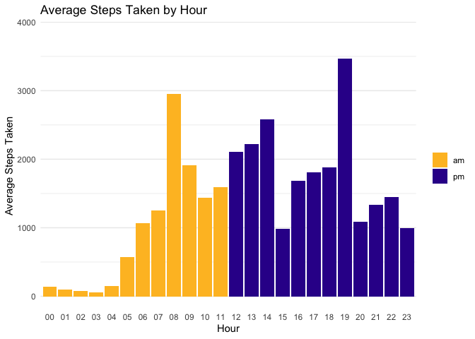

AM vs. PM Activity: The “am_pm” column indicates whether the activity
occurred during the morning (AM) or afternoon/evening (PM). You can
compare the activity patterns between these two periods and explore any
differences in user behavior during these times.

## EDA for seconds_heartrate_clean

``` r
str(seconds_heartrate_clean)
```

    tibble [2,483,658 × 3] (S3: tbl_df/tbl/data.frame)
     $ id        : chr [1:2483658] "2022484408" "2022484408" "2022484408" "2022484408" ...
     $ date_time : POSIXct[1:2483658], format: "2016-04-12 07:21:00" "2016-04-12 07:21:05" ...
     $ heart_rate: num [1:2483658] 97 102 105 103 101 95 91 93 94 93 ...

``` r
seconds_heartrate_clean %>% summary()
```

          id              date_time                        heart_rate    
     Length:2483658     Min.   :2016-04-12 00:00:00.00   Min.   : 36.00  
     Class :character   1st Qu.:2016-04-19 06:18:10.00   1st Qu.: 63.00  
     Mode  :character   Median :2016-04-26 20:28:50.00   Median : 73.00  
                        Mean   :2016-04-26 19:43:52.24   Mean   : 77.33  
                        3rd Qu.:2016-05-04 08:00:20.00   3rd Qu.: 88.00  
                        Max.   :2016-05-12 16:20:00.00   Max.   :203.00  

``` r
n_distinct(seconds_heartrate_clean$id)
```

    [1] 14

``` r
# Group by 'id' and calculate the average heart rate for each user
average_heart_rate <- seconds_heartrate_clean %>%
  group_by(id) %>%
  summarise(average_heart_rate = mean(heart_rate, na.rm = TRUE))

# Bar Plot with smaller bars and custom breaks on the heart rate axis
bar_plot <- ggplot(average_heart_rate, aes(x = id, y = average_heart_rate)) +
  geom_bar(stat = "identity", fill = "#ADD8E6", width = 0.8) +  # Adjust the width here (e.g., 0.5 for smaller bars)
  labs(x = "User ID", y = "Average Heart Rate", title = "Average Heart Rate for Each User") +
  theme_minimal() + coord_flip() +
  scale_y_continuous(breaks = seq(0, 100, 10), limits = c(0, 100))+ # Set custom breaks and limits for the y-axis 
  geom_hline(yintercept = 60, linetype = "dashed", color = "green") +
  geom_hline(yintercept = 100, linetype = "dashed", color = "green") 

# Display the bar plot
print(bar_plot)
```


Observations:

- Users’ average heart rate is within the normal range. Nothing
  remarkable here.
- We could suggest adding a feature to the app that sends notifications
  to users whose average resting heart rate falls outside the normal
  range.

## EDA for weight_logs_clean

``` r
str(weight_logs_clean)
```

    tibble [67 × 8] (S3: tbl_df/tbl/data.frame)
     $ id              : chr [1:67] "1503960366" "1503960366" "1927972279" "2873212765" ...
     $ date_time       : POSIXct[1:67], format: "2016-05-02 23:59:59" "2016-05-03 23:59:59" ...
     $ weight_kg       : num [1:67] 52.6 52.6 133.5 56.7 57.3 ...
     $ weight_pounds   : num [1:67] 116 116 294 125 126 ...
     $ fat             : num [1:67] 22 0 0 0 0 25 0 0 0 0 ...
     $ bmi             : num [1:67] 22.6 22.6 47.5 21.5 21.7 ...
     $ is_manual_report: logi [1:67] TRUE TRUE FALSE TRUE TRUE TRUE ...
     $ log_id          : num [1:67] 1.46e+12 1.46e+12 1.46e+12 1.46e+12 1.46e+12 ...

- Fat:Body fat percentage recorded.

- BMI: Measure of body mass index based on the height and weight in the
  participant’s Fitbit.com profile.

- isManualReport: If the data for this weigh-in was done manually
  (TRUE), or if data was measured and synced directly to Fitbit.com from
  a connected scale (FALSE).

For more detail check : [Fitbit data
dictionary](https://www.fitabase.com/resources/knowledge-base/exporting-data/data-dictionaries/)

``` r
weight_logs_clean %>% summary()
```

          id              date_time                        weight_kg     
     Length:67          Min.   :2016-04-12 06:47:11.00   Min.   : 52.60  
     Class :character   1st Qu.:2016-04-19 15:19:45.00   1st Qu.: 61.40  
     Mode  :character   Median :2016-04-27 23:59:59.00   Median : 62.50  
                        Mean   :2016-04-27 15:39:54.27   Mean   : 72.04  
                        3rd Qu.:2016-05-04 15:24:10.50   3rd Qu.: 85.05  
                        Max.   :2016-05-12 23:59:59.00   Max.   :133.50  
     weight_pounds        fat               bmi        is_manual_report
     Min.   :116.0   Min.   : 0.0000   Min.   :21.45   Mode :logical   
     1st Qu.:135.4   1st Qu.: 0.0000   1st Qu.:23.96   FALSE:26        
     Median :137.8   Median : 0.0000   Median :24.39   TRUE :41        
     Mean   :158.8   Mean   : 0.7015   Mean   :25.19                   
     3rd Qu.:187.5   3rd Qu.: 0.0000   3rd Qu.:25.56                   
     Max.   :294.3   Max.   :25.0000   Max.   :47.54                   
         log_id         
     Min.   :1.460e+12  
     1st Qu.:1.461e+12  
     Median :1.462e+12  
     Mean   :1.462e+12  
     3rd Qu.:1.462e+12  
     Max.   :1.463e+12  

``` r
# Create boxplots for "bmi" and "weight_pounds"

columns_to_analyze <- c("bmi", "weight_pounds")

# Call the function to create boxplots 
create_boxplots_in_one_output(weight_logs_clean, columns_to_analyze, decimal_places = 2)
```


``` r
entry_count <- weight_logs_clean %>%
  group_by(id, is_manual_report) %>%
  summarize(entry_count = n(), .groups = "keep") %>%
  arrange (- entry_count)

print(entry_count)
```

    # A tibble: 8 × 3
    # Groups:   id, is_manual_report [8]
      id         is_manual_report entry_count
      <chr>      <lgl>                  <int>
    1 6962181067 TRUE                      30
    2 8877689391 FALSE                     24
    3 4558609924 TRUE                       5
    4 1503960366 TRUE                       2
    5 2873212765 TRUE                       2
    6 4319703577 TRUE                       2
    7 1927972279 FALSE                      1
    8 5577150313 FALSE                      1

``` r
# Check users that reported fat percentage
weight_logs_clean %>% filter(fat != 0)
```

    # A tibble: 2 × 8
      id         date_time           weight_kg weight_…¹   fat   bmi is_ma…²  log_id
      <chr>      <dttm>                  <dbl>     <dbl> <dbl> <dbl> <lgl>     <dbl>
    1 1503960366 2016-05-02 23:59:59      52.6      116.    22  22.6 TRUE    1.46e12
    2 4319703577 2016-04-17 23:59:59      72.4      160.    25  27.5 TRUE    1.46e12
    # … with abbreviated variable names ¹​weight_pounds, ²​is_manual_report

Observation: - Only two users reported fat percentage

``` r
# Calculate total entries
total_entries <- sum(entry_count$entry_count)


average_bmi_weight <- weight_logs_clean %>%
  group_by(is_manual_report) %>%
  summarize(mean_bmi = mean(bmi, na.rm = TRUE),
            mean_weight_pounds = mean(weight_pounds, na.rm = TRUE),
            entry_count = n(),
            entry_count_percentage = round((n()/total_entries)*100,2),
            .groups = "keep") 

print(average_bmi_weight)
```

    # A tibble: 2 × 5
    # Groups:   is_manual_report [2]
      is_manual_report mean_bmi mean_weight_pounds entry_count entry_count_percent…¹
      <lgl>               <dbl>              <dbl>       <int>                 <dbl>
    1 FALSE                26.4               192.          26                  38.8
    2 TRUE                 24.4               138.          41                  61.2
    # … with abbreviated variable name ¹​entry_count_percentage

Observation: - 61% of users log their weight manually, while 39% sync
their weight from other devices

``` r
create_custom_box_plot(weight_logs_clean , x_axis_col = "is_manual_report", y_axis_col = "weight_pounds", orientation = "hor", colors = custom_colors)
```


``` r
# Use the remove_outliers function we created previously to remove the outliers

columns_with_outliers <- c("weight_pounds", "bmi")


# Loop through each column and remove outliers
for (col in columns_with_outliers) {
  weight_logs_clean <- remove_outliers(weight_logs_clean, col)
}
```

``` r
dim(weight_logs_clean)
```

    [1] 64  8

``` r
create_custom_box_plot(weight_logs_clean , x_axis_col = "is_manual_report", y_axis_col = "weight_pounds", orientation = "hor", colors = custom_colors)
```


Observations:

- It appears that users who log their weight data manually have a lower
  median weight than users who sync their weight from other devices.

- The previous observation should be viewed as exploratory and could
  benefit from additional data. The weight log dataset only has 68
  entries; more data would be needed to evaluate these hunches.

- The lack of completeness in the weight log dataset could indicate a
  lack of user engagement.

# References

### Guidelines and research articles

- 1.  Handling sedentary time: [A Comparison of Sedentary Behavior as
      Measured by the Fitbit and ActivPAL in College
      Students](https://www.mdpi.com/1660-4601/18/8/3914)

- 2.  Danger of prolong sitting(sedentary time): [Association of daily
      sitting time and leisure-time physical activity with body fat
      among U.S. adults. Journal of Sport and Health
      Science](https://www.sciencedirect.com/science/article/pii/S2095254622001016)

- 3.  [Dietary Guidelines for Americans,
      2020-2025](https://www.dietaryguidelines.gov/)

- 4.  [Physical Activity Guidelines for Americans (2nd
      ed.)](https://health.gov/sites/default/files/2019-09/Physical_Activity_Guidelines_2nd_edition.pdf)

### Links

- [Projects Datasets:](https://www.kaggle.com/datasets/arashnic/fitbit)

- [EDA guide](https://rpubs.com/jovial/r)

- Metadata: [Fitbit data
  dictionary](https://www.fitabase.com/resources/knowledge-base/exporting-data/data-dictionaries/)

- [Plotting histograms with
  ggplot2](https://appsilon.com/ggplot2-histograms/)

- [Histograms article](https://statisticsbyjim.com/basics/histograms/)

- [Error bars vs
  CI](https://blogs.sas.com/content/iml/2019/10/09/statistic-error-bars-mean.html)

- [Add density line to histogram](https://r-coder.com/density-plot-r)

- [Categorical, ordinal, interval,
  variables](https://www.graphpad.com/guides/prism/latest/statistics/the_different_kinds_of_variabl.htm)

### Appendix: Interesting sites for further investigation

- [Adult Physical Inactivity Prevalence Maps by
  Race/Ethnicity](https://www.cdc.gov/physicalactivity/data/inactivity-prevalence-maps/index.html#Race-Ethnicity)

- [Physical activity among adults aged 18 and over : United States,
  2020](https://stacks.cdc.gov/view/cdc/120213)
