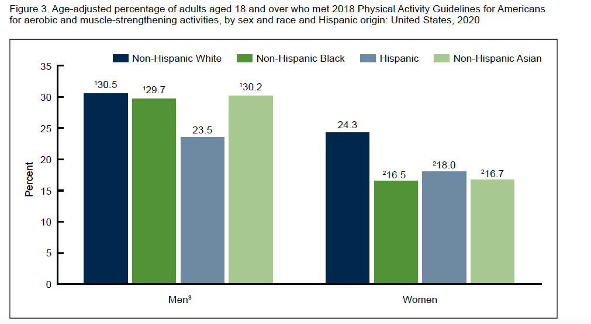

# Google Data Analytics Certificate Capstone (Bellabeat Case Study)
By Gabriel Fernandez

## Introduction

Welcome to my Google Analytics Certificate Capstone Project, centered around the Bellabeat case study (Case Study 2: How can a wellness company play it smart?). My objective is to analyze smart device fitness data for Bellabeat, a high-tech manufacturer of health-focused products for women, with a specific focus on the Bellabeat app.  

Through this case study, I will gain valuable insights into how consumers are using the Bellabeat app by performing data analysis. By following the data analysis process steps—Ask, Prepare, Process, Analyze, Share, and Act— I aim to unlock growth opportunities and provide high-level recommendations to guide Bellabeat's marketing strategy.

In this case study, I chose to use **R(RStudio and R Markdown)** for its versatility in completing all phases of data analysis and effectively documenting my findings. This certificate program also introduced me to other valuable tools, including Spreadsheets, SQL, and Tableau.

Visit the [Bellabeat website](https://bellabeat.com/) to learn the company that inspired this case study.

### Business problem

Bellabeat, a successful small company, has the potential to become a major player in the global smart device market. Urška Sršen, the visionary co-founder and Chief Creative Officer, believes that analyzing smart device data can lead to new growth avenues. As a part of the marketing analytics team, I have been tasked with analyzing smart device usage data for the Bellabeat app to guide marketing strategy based on user behavior insights.

Bellabeat offers smart wellness products and services, including:

- **Bellabeat App**: Tracks activity, sleep, stress, menstrual cycle, and mindfulness habits, providing insights for a healthier lifestyle.
- Leaf: A versatile wellness tracker worn as a bracelet, necklace, or clip, monitoring activity, sleep, and stress.
- Time: A smart wellness watch tracking activity, sleep, and stress, providing daily insights.
- Spring: A water bottle that monitors daily water intake to ensure proper hydration.
- Bellabeat Membership: A subscription-based program offering personalized guidance on nutrition, activity, sleep, health, beauty, and mindfulness.

### Data analysis process

I will follow a systematic data analysis process that I learned in the Google Analytics Certificate:

- **Ask**: Formulating pertinent questions to guide my analysis.
- **Prepare**: Gathering and organizing relevant data for analysis.
- **Process**: Cleaning and transforming data for accuracy.
- **Analyze**: Extracting valuable insights from the data.
- **Share**: Presenting my findings to the Bellabeat executive team.
- **Act**: Offering high-level recommendations for Bellabeat's marketing strategy.

See original source :[Google Data Analytics Professional Certificate by Coursera](https://www.coursera.org/learn/foundations-data/supplement/Yo3Cn/the-data-analysis-process-and-this-program)

### Deliverables for each phase
1. A clear summary of the business task 
2. A description of all data sources used 
3. Documentation of any cleaning or manipulation of data 
4. A summary of your analysis 
5. Supporting visualizations and key findings 
6. Your top high-level content recommendations based on your analysis

## Ask :question:

**Deliverable 1**: Business task (The question or problem data analysis resolves for a business)

Analyze smart fitness device usage data to gain insight into how people already use them and help guide future marketing strategies for the Bellabeat App. Key stakeholders are Urška Sršen, Sando Mur, and the Bellabeat marketing analytics team.

## Prepare 🛠

**Deliverable 2**: Data source description

**Data**: Introducing the Fitbit Fitness Tracker Data

- Brief: Fitbit Fitness Tracker Data, collected via Amazon Mechanical Turk from 30 users in late 2016, offers minute-level physical activity, heart rate, and sleep monitoring. It is accessible on Kaggle.
- Access the data: [FitBit Fitness Tracker Data](https://www.kaggle.com/arashnic/fitbit)
- Contributor: Kaggle user [Möbius](https://www.kaggle.com/arashnic), a Data Scientist specializing in Healthcare.

**Bias and credibility concerns**

The data collection method through Amazon Mechanical Turk introduces potential biases, including sampling, selection, demographic, and incentive-driven biases. These biases may affect the generalizability of findings.

**Data quality checks (ROCCC)**

| Data Quality Check  | Assessment                                                                                   |
|---------------------|----------------------------------------------------------------------------------------------|
| Reliable            | Moderate; user-friendly but concerns about generalizability exist.                        |
| Original            | No; data collected from a third-party source through Amazon Mechanical Turk.               |
| Comprehensible      | Moderate; comprehensibility is affected by variations in participant numbers.              |
| Current             | Outdated; the data is from 2016, potentially affecting the relevance of findings.          |
| Cited               | Yes; data source is properly cited, ensuring transparency and attribution.                  |

**Licensing, privacy, security, and  accessibility**

| Data Aspect    | Assessment                                                       |
|----------------|-------------------------------------------------------------------|
| Licensing      | The data is under CC0 1.0 Universal Public Domain Dedication, allowing unrestricted use for commercial purposes. |
| Privacy        | No personally identifiable information is present in the data.   |
| Security       | I practiced this step, storing the original data in a password-protected MySQL database. |
| Accessibility  | The data is accessible on Kaggle for ease of access and sharing within the data analysis community. |

**Data integrity verification**

Data integrity was ensured through exploratory data analysis and cleaning processes, including column standardization, data type conversion, duplicate removal, zero-value observation removal, and comprehensive data assessment. See the guiding questions for this phase for more details.

**Relevance to analysis**

These datasets provide valuable insights for health and fitness analysis. However, potential biases and data quality concerns should be considered when interpreting the results. Additionally, the lack of gender information may limit its applicability, particularly for products targeted at women by companies like Bellabeat.

Note: During the completion of the capstone, I encountered difficulty in finding an alternative Fitbit dataset, highlighting the challenge of accessing proprietary data. However, during my research, I came across many research articles and analysis that can complement the insights gained from this project. You can find this in the appendix under Supplementary Material.

## Process 🔄

**Deliverable 3**: Documentation of any cleaning or manipulation of data 

All data cleaning steps are documented in the project's [R_notebook](Bellabeat_case_study_gabriel_fernandez.md). Please refer to the notebook for more details. The following are the most important steps I undertook:

- Checked for missing values.
- Changed column names to lowercase for consistency.
- Converted data types.
- Removed duplicates where necessary.
- Identified and removed observations with zero values in the "total_steps" column.
- Conducted an analysis of the distribution of IDs across datasets to identify potential discrepancies in data collection methods, completeness, or user engagement.
- Merged related datasets (hourly_calories, hourly_intensities, and hourly_steps) into a single dataset named "hourly_activity."
- Performed Exploratory Data Analysis (EDA) and summary statistics to better understand the data, detecting anomalies or inconsistencies.
- Identified data inconsistencies and alerted potential issues, such as discrepancies between "sedentary_minutes" and "total_minutes_asleep."
- Assessed data completeness by identifying users with missing activity data and observing declines in data reporting from some users during specific periods.

## Analyze 📉

**Deliverable 4**: A summary of your analysis 

While exploring the activity minutes categories (sedentary, lightly active, fairly active, and very active), I recognized the potential to apply a similar categorization method to other variables. In short, I employed a segmentation approach to reveal user patterns informed by fitness research and government guidelines. The following were the most important findings from my analysis:

**Data insights**
- The incomplete weight log dataset suggests potential low user engagement. Users seem to have not adopted the habit of logging data on their smart devices. For instance,  only two users reported their fat percentage in the weight_logs data.

- The Kaggle dataset description states that 30 users provided their data. In the available datasets, the numbers within the parentheses represent the unique IDs for each dataset: "daily_activity_clean" (33), "hourly_activity_clean" (33), "daily_sleep_clean" (24), "minute_sleep_clean" (24), "seconds_heartrate_clean" (14), and "weight_logs_clean" (8). Two potential explanations for the discrepancy could be multiple Fitbit devices per user, leading to more unique IDs than users, or an oversight in the dataset description.

- The variables "calories" and "sedentary_minutes" exhibit a multimodal distribution, indicating the presence of subpopulations within the data. In this dataset, gender could be a potential variable, resulting in a bimodal distribution when examining histograms of calories and sedentary minutes. Unfortunately, the gender of the users is not provided, limiting our ability to confirm this hypothesis.

- Activity data is missing, notably in early May. Users with over 75% data consistency consistently report activity dates, but those with less than 75% data show a decline in reporting starting in late April. The drop in Activity Date reporting appears to be linked to some users not reporting data during that period.

- I identified an inconsistency in the sedentary minutes data. The dataset includes a variable labeled "sedentary_minutes," which, as per the metadata, was supposed to represent the total minutes spent in sedentary activity. However, I found that in 42 entries, "sedentary_minutes" was less than "total_minutes_asleep." To address this, I removed these problematic entries from the dataset. I thoroughly documented this process in my R Notebook.

- Correlations Between Activity Metrics: Several activity metrics, such as "total_distance," "tracker_distance," and "total_steps," are highly correlated. This suggests that these metrics provide similar information. Additionally, there are correlations between different intensity minutes and distance covered, indicating different aspects of the same activity.

**User behavior insights**

**Activity  insights**

- Over half of the users maintain a healthy daily step count range of 5,000 to 10,000 steps, but only one-fifth achieve the 10,000-step milestone.
- About 55% of users walk an average of 5-10 kilometers daily, approximately 5 miles.
- Users' overall average intensity minutes consist primarily of sedentary and lightly active time, comprising 97%.
Sedentary activities make up the majority of users' average intensity minutes, at around 80%. Lightly active time accounts for 17%, while very active and fairly active minutes are limited to 2% and 1%, respectively. These findings point to a potential deficit in moderate to vigorous physical activity.
- Approximately 48% of users accumulate at least 400 daily sedentary minutes while awake, equivalent to exceeding 6 hours of daily sedentary time.
- On average, users exhibit greater intensity in their activity at 5:00 AM, 8:00 AM, 5:00 PM, and 7:00 PM, along with recording higher step counts at 8:00 AM and 7:00 PM. These findings imply that daily routines and responsibilities could influence user activity levels, particularly before or after standard workday hours.
-Caloric Expenditure: Approximately 42% of users maintain an average daily calorie expenditure ranging from 1,600 to 2,200, aligning with the recommended daily calorie intake for many females, as outlined in the Dietary Guidelines for Americans, 2020-2025.

**Sleep insights**

- More than half  (52%) of the users have an average daily sleep duration of less than 7 hours, indicating potential sleep deficiency.
- Napping is infrequent among users. In most sleep records (89%), users typically experience a single continuous sleep period, including naps lasting over 60 minutes.
- Most user sleep states are uninterrupted periods of sleep, covering 91% of total sleep time. Restlessness occurs during 7.4% of sleep minutes, and being fully awake represents just 1.1% of the time.
- Upon segmenting the users into regular and irregular sleepers, we discovered that regular sleepers, on average, get more sleep, have a more consistent sleep duration, and have slightly higher median awake-in-bed duration than irregular sleepers.

**Heart rate**
- Users' average heart rate is within the normal range. 

**Weight logging behavior**

The following insights should be viewed as exploratory and could benefit from additional data. The weight log dataset only has 68 entries; more data would be needed to evaluate these hunches.
- Most users (61%) manually log their weight, while 39% sync it from other devices. Manual logging may be associated with lower median weight.
- Users who manually log their weight data have a lower median weight than those who sync their weight from other devices.

These insights can provide valuable information to inform Bellabeat App's marketing strategy and product improvement opportunities. By analyzing user activity and sleep patterns, interaction with its app, and potential subpopulations within the dataset, Bellabeat can refine its marketing strategies to boost user engagement and maximize app usage.

## Share 📢

**Deliverable 5**: Supporting visualizations and key findings 

The insights I have uncovered, particularly those related to user activity, sleep patterns, and engagement, explain how users interact with the Bellabeat App and its features. 

I adapted my approach to cater to the distinct preferences and needs of two key audiences:

- The Bellabeat Founders require a visually intuitive presentation of insights due to their busy schedules and limited technical interest. I created a poster summarizing essential findings using standalone visualizations to meet this requirement. A detailed R Markdown report is also available for those seeking more in-depth information.

The [PDF poster](images/key_insights_poster.pdf) allows zooming for a closer look.

- For the Marketing Analytics Team: This audience typically requires comprehensive insights and might be interested in data details. I provided an R Markdown report containing extensive details, allowing them to explore the underlying code and methodology.

[R_notebook](Bellabeat_case_study_gabriel_fernandez.md)

In this manner, I ensured that the reporting methods aligned with each group's specific requirements and preferences.

## Act 🏁 

**Deliverable 6**: Your top high-level insights based on your analysis 

Bellabeat can leverage insights on activity, sleep, and engagement patterns to implement targeted approaches for different user segments. I want to propose the following recommendations to guide the Bellabeat market strategy:

 - Since many users are not meeting activity and sleep guidelines and spend excessive time in sedentary activities, Bellabeat should adopt personalized interventions to encourage them to develop healthier activity and sleep patterns. This can lead to improved user engagement and satisfaction, higher retention rates, positive word-of-mouth marketing, and a more health-conscious user base. The increased value experienced within the app ecosystem makes switching to a competitor less likely.

- Addressing low engagement in data logging and data quality issues is a critical step in enhancing user retention. By leveraging A/B testing and nudges to improve the interface and encourage data logging, we can provide greater value to our customers in their pursuit of healthier habits. As we deliver more value through the app, our customers are more likely to promote it through positive word-of-mouth marketing, further expanding our market share.

- Optimize in-app notifications for promotions and new features by aligning them with users' activity patterns. This strategy minimizes costs and risks while enhancing user engagement. Utilize A/B testing for maximum impact. As users recognize the increased value through these well-timed notifications, they are more likely to engage in positive word-of-mouth marketing, fostering expansion with low financial risk.

These recommendations could guide the marketing strategy by focusing on personalized interventions, data quality improvement, and well-timed notifications to enhance user engagement, satisfaction, and retention. These strategies promote positive word-of-mouth marketing, minimize costs, reduce risks, and expand market share, making it less likely for users to switch to competitors.

Some ideas to discuss with the product development team:

- To help users become active, how can we implement nudges to help them reach the recommended physical activity guidelines by the CDC?
- Given the high sedentary minutes observed, can we provide users with reminders or prompts to reduce prolonged periods of inactivity?
- How can personalized activity recommendations be based on observed trends and user behavior?
- How can we promote healthy sleep patterns and provide tips for improving sleep duration?

## Limitations

  - The data used for analysis, Fitbit Fitness Tracker Data, was collected via Amazon Mechanical Turk from a relatively small sample of 30 users in late 2016. This limited sample size may not be fully representative of the broader population, and findings may not generalize well.

  - The data collected through Amazon Mechanical Turk introduces potential biases, including sampling, selection, demographic, and incentive-driven biases, which can affect the generalizability of findings.

  - The data is from 2016, which may not accurately represent current user behavior, potentially impacting the relevance of the analysis.

  - The absence of gender data in the analysis is a significant limitation because it affects the ability to perform gender-specific marketing strategy analyses. This limitation is particularly important as Bellabeat caters to women.

  - The weight log dataset has limited entries (68), which may not provide a comprehensive understanding of user weight tracking behavior.

  - The absence of additional data sources is a limitation that may impede the validation or extension of the findings.

## Supplementary Material

## Guiding questions for each phase

  
 Click here to see the guiding questions

### Ask 

**What is Bellabeat Mission?**

Bellabeat empowers women to reconnect with themselves, unleash their inner strengths and be what they were meant to be.

**Who are the stakeholders?**

- Urška Sršen: Bellabeat’s cofounder and Chief Creative Officer 
- Sando Mur: Mathematician and Bellabeat’s cofounder; key member of the Bellabeat executive team 
- Bellabeat marketing analytics team: A team of data analysts responsible for collecting, analyzing, and reporting data that helps guide Bellabeat’s marketing strategy. As a junior data analyst on this team for six months, I've been learning about Bellabeat's mission and business goals and how I can assist in achieving them.

**What is the problem that I am trying to solve?** 

- Analyze smart device usage data (in the market) in order to gain insight into how people are already using their smart devices
- Discover insights to unlock growth opportunities
  
**How can your insights drive business decisions?** 

- Trends can inform Bellabeat marketing strategy
- Usage can inspire product modification
- Insights could unlock new growth opportunities for the company

### Prepare

**Where is your data stored?**

The original data is stored in my password-protected MySQL database on my local user account.

**How is the data organized? Is it in long or wide format?**

Most datasets are organized in a long format, but some redundant datasets are in a wide format. The datasets are in CSV files.

**Are there issues with bias or credibility in this data? Does your data ROCCC?**

Amazon Mechanical Turk (MTurk) facilitated the collection of Fitbit data for the Kaggle dataset. It served as the platform for outsourcing the task of gathering Fitbit data to a widely distributed workforce. Participants who shared their Fitbit data on MTurk may have earned compensation; usually, MTurk typically provides income-earning opportunities. The way these datasets were collected raised the following integrity concerns:

- Sampling bias: The data is derived from a non-random selection of 30 Fitbit users, making it an imperfect representation of the broader population.
- Selection bias: Data collected from Amazon Mechanical Turk (MTurk) depends on participants' voluntary choices, potentially resulting in a non-representative sample.
- Demographic bias: MTurk participants tend to be younger and more tech-savvy, which may limit the generalizability of findings across different age and gender groups.
- Incentive-driven bias: Some MTurk respondents may prioritize speed to maximize their earnings, potentially compromising the data's accuracy
  
Key data quality checks - ROCCC (Reliable, Original, Comprehensible, Current, and Cited):

- Reliable (Moderate): While the data receives a high usability rating of 10 on Kaggle, signifying its user-friendliness, its sourcing raises concerns about generalizability. As a result, any insights derived from this data should be approached with caution.
- Original (No): The data is not original; it was collected from a third-party source involving 30 Fitbit users through Amazon Mechanical Turk. While acquiring data directly from the source would be ideal, it's often not feasible, particularly with proprietary datasets like these.
- Comprehensible (Moderate): The data's comprehensibility is compromised by variations in participant numbers across datasets, potentially impacting the insights drawn from it. For instance, different participant counts across datasets may lead to difficulties in making accurate comparisons and drawing conclusions from the data.
- Current (Outdated): The data is not current, dating back to 2016. While it offers insights for that year, it might not accurately reflect recent trends, potentially impacting the relevance of current findings.
- Cited (Yes): Yes, the data source is cited, indicating transparency and proper attribution to the original data provider.

**How are you addressing licensing, privacy, security, and accessibility?** 

- Licensing: The data is under CC0 1.0 Universal (CC0 1.0) Public Domain Dedication, allowing unrestricted copying, modification, distribution, and use for commercial purposes without seeking permission.
- Privacy: No personally identifiable information is present in the data.
- Security: I practiced this step, storing the original data in a password-protected MySQL database.
- Accessibility: The data is also accessible on Kaggle, ensuring ease of access and sharing within the data analysis community.

**How did you verify the data’s integrity?**

I verified the integrity of the data by performing exploratory data analysis and data cleaning steps.  

**Are there any problems with the data?**

The data exhibits reliability, originality, comprehensibility, and currency issues. Furthermore, verifying data from its original source is not possible, underscoring the need for caution. Another issue I found with the data is the lack of gender information. This is relevant for Bellabeat,  a company producing products for women. If all the data comes from male participants, the insights might not be generalizable to the female users. This is another disadvantage of using Amazon Mechanical Turk to source fitness wearable data. 

**How does it help you answer your question?**

This information is crucial for me in interpreting and analyzing the dataset. It warns me about potential biases and issues, allowing me to approach any analysis or conclusions cautiously. It also highlights limitations, such as the lack of gender information, which could affect the generalizability of insights for a company like Bellabeat. 

## Process 

**What tools are you choosing and why?**

I explored all the tools from the Google Analytics certificate program, including Google Sheets, BigQuery, Tableau, and R. Also, I used MySQL because it gave me more flexibility than the free version of BigQuery.

- Google Sheets: Performed basic exploratory analysis
- BigQuery: Loaded all the datasets to BigQuery and practiced aggregations.
- Tableau: performed some exploratory data analysis.
- MySQL: I initially faced issues loading data using the MySQL Workbench UI. However, I persevered and discovered a faster and more efficient method: loading all the datasets through the terminal.

In the end, **I selected R in RStudio** for the Capstone project because it enabled transparent documentation of data analysis processes with R Notebooks, including data cleaning, transformation, and visualizations. Also, R Markdown made it easy to share my analysis on platforms such as Kaggle and GitHub, making the findings accessible to others interested in the work.

**Have you ensured your data’s integrity?** 
Data integrity was ensured through exploratory data analysis and cleaning processes, including column standardization, data type conversion, duplicate removal, zero-value observation removal, and comprehensive data assessment. See the guiding questions for this phase for more details.

**What steps have you taken to ensure that your data is clean?**

All data cleaning steps are documented in the project's R notebook. Please refer to the notebook for more details. The following are the most important steps I undertook:

- Checked for missing values.
- Changed column names to lowercase for consistency.
- Converted data types.
- Removed duplicates where necessary.
- Identified and removed observations with zero values in the "total_steps" column.
- Conducted an analysis of the distribution of IDs across datasets to identify potential discrepancies in data collection methods, completeness, or user engagement.
- Merged related datasets (hourly_calories, hourly_intensities, and hourly_steps) into a single dataset named "hourly_activity."
- Performed Exploratory Data Analysis (EDA) and summary statistics to better understand the data, detecting anomalies or inconsistencies.
- Identified data inconsistencies and alerted potential issues, such as discrepancies between "sedentary_minutes" and "total_minutes_asleep."
- Assessed data completeness by identifying users with missing activity data and observing declines in data reporting from some users during specific periods.

**How can you verify that your data is clean and ready to analyze?**

After cleaning and transforming the data, I conducted exploratory data analysis (EDA) on each cleaned dataset. I stored each dataset in a new object to preserve the original data. Additionally, I exported the clean datasets. The EDA encompassed:

- Univariate analysis for numerical variables
- Univariate analysis for categorical variables
- Bivariate analysis
- Summary statistics
  
**Have you documented your cleaning process so you can review and share those results?** 
I documented my data cleaning process in an R notebook, noting any issues before proceeding with each step. This detailed record makes it easy for me to review personally and allows for sharing of results with others. Also, I thoroughly documented all findings and insights under the "Observations" section in my notebook.

## Analyze 

**How should you organize your data to perform analysis on it?**

After conducting the Exploratory Data Analysis (EDA), I initially felt uncertain about the next steps. Usually, when you are learning data analysis, the textbooks provide clean datasets with variables such as gender, age, and various other demographic attributes. These variables offer clear directions for exploration and the opportunity to derive meaningful insights. In this case, the data had many integrity issues and lacked standard demographic variables. My first insight into how to uncover user patterns happened when I explored the activity minutes categories (sedentary, lightly active, fairly active, and very active). I noticed that I could apply a similar categorization/segmentation method for activity minutes for the other variables. This approach ultimately led to the discovery of several interesting insights. I created a new "User behavior" section in the R Notebook to perform this type of analysis.  

**Has your data been properly formatted?**
I formatted and prepared my data during the previous two phases: Prepare and Process.

**What surprises did you discover in the data?**

- The incomplete weight log dataset suggests potential low user engagement. Users seem to have not adopted the habit of logging data on their smart devices. For instance,  only two users reported their fat percentage in the weight_logs data.
- The Kaggle dataset description states that 30 users provided their data. In the available datasets, the numbers within the parentheses represent the unique IDs for each dataset: "daily_activity_clean" (33), "hourly_activity_clean" (33), "daily_sleep_clean" (24), "minute_sleep_clean" (24), "seconds_heartrate_clean" (14), and "weight_logs_clean" (8). Two potential explanations for the discrepancy could be multiple Fitbit devices per user, leading to more unique IDs than users, or an oversight in the dataset description.
- The variables "calories" and "sedentary_minutes" exhibit a multimodal distribution, indicating the presence of subpopulations within the data. In this dataset, gender could be a potential variable, resulting in a bimodal distribution when examining histograms of calories and sedentary minutes. Unfortunately, the gender of the users is not provided, limiting our ability to confirm this hypothesis.
- Activity data is missing, notably in early May. Users with over 75% data consistency consistently report activity dates, but those with less than 75% data show a decline in reporting starting in late April. The drop in Activity Date reporting appears to be linked to some users not reporting data during that period.
- I identified an inconsistency in the sedentary minutes data. The dataset includes a variable labeled "sedentary_minutes," which, as per the metadata, was supposed to represent the total minutes spent in sedentary activity. However, I found that in 42 entries, "sedentary_minutes" was less than "total_minutes_asleep." To address this, I removed these problematic entries from the dataset. I thoroughly documented this process in my R Notebook.
- Correlations Between Activity Metrics: Several activity metrics, such as "total_distance," "tracker_distance," and "total_steps," are highly correlated. This suggests that these metrics provide similar information. Additionally, there are correlations between different intensity minutes and distance covered, indicating different aspects of the same activity.

**What trends or relationships did you find in the data?**

**Activity  insights**
- Over half of the users maintain a healthy daily step count range of 5,000 to 10,000 steps, but only one-fifth achieve the 10,000-step milestone.
- About 55% of users walk an average of 5-10 kilometers daily, approximately 5 miles.

**Intensity minutes**

- Users' overall average intensity minutes consist primarily of sedentary and lightly active time, comprising 97%.
- Sedentary activities make up the majority of users' average intensity minutes, at around 80%. Lightly active time accounts for 17%, while very active and fairly active minutes are limited to 2% and 1%, respectively. These findings point to a potential deficit in moderate to vigorous physical activity.
- Approximately 48% of users accumulate at least 400 daily sedentary minutes while awake, equivalent to exceeding 6 hours of daily sedentary time.
- On average, users exhibit greater intensity in their activity at 5:00 AM, 8:00 AM, 5:00 PM, and 7:00 PM, along with recording higher step counts at 8:00 AM and 7:00 PM. These findings imply that daily routines and responsibilities could influence user activity levels, particularly before or after standard workday hours.

**Caloric expenditure**

- Approximately 42% of users maintain an average daily calorie expenditure ranging from 1,600 to 2,200, aligning with the recommended daily calorie intake for many females, as outlined in the Dietary Guidelines for Americans, 2020-2025.

**Sleep insights**

- More than half (52%) of the users have an average daily sleep duration of less than 7 hours, indicating potential sleep deficiency.
- Napping is infrequent among users. In most sleep records (89%), users typically experience a single continuous sleep period, including naps lasting over 60 minutes.
- Most user sleep states are uninterrupted periods of sleep, covering 91% of total sleep time. Restlessness occurs during 7.4% of sleep minutes, and being fully awake represents just 1.1% of the time.
- Upon segmenting the users into regular and irregular sleepers, we discovered that regular sleepers, on average, get more sleep, have a more consistent sleep duration, and have slightly higher median awake-in-bed duration than irregular sleepers.

**Heart rate**
- Users' average heart rate is within the normal range. 

**Weight logging behavior**

The following insights should be viewed as exploratory and could benefit from additional data. The weight log dataset only has 68 entries; more data would be needed to evaluate these hunches.
- Most users (61%) manually log their weight, while 39% sync it from other devices. Manual logging may be associated with lower median weight.
- Users who manually log their weight data have a lower median weight than those who sync their weight from other devices.

**How will these insights help answer your business questions?**

These insights can provide valuable information to inform Bellabeat App's marketing strategy and product improvement opportunities. By analyzing user activity and sleep patterns, interaction with its app, and potential subpopulations within the dataset, Bellabeat can refine its marketing strategies to boost user engagement and maximize app usage.

## Share

**Were you able to answer the business questions?**

I found many behavioral insights that can guide marketing strategy and product improvement.

**What story does your data tell?**

Bellabeat can leverage insights on activity, sleep, and engagement patterns to implement targeted approaches for different user segments. This can lead to increased user retention and higher levels of satisfaction. Additionally, encouraging users to log weight data can promote a more comprehensive and engaged use of the app and improve the data quality. 

**How do your findings relate to your original question?**

The insights I have uncovered, particularly those related to user activity, sleep patterns, and engagement, clearly explain how users interact with the Bellabeat App and its features. 

**Who is your audience? What is the best way to communicate with them?**

I adapted my approach to cater to the distinct preferences and needs of two key audiences:

- The Bellabeat Founders require a visually intuitive presentation of insights due to their busy schedules and limited technical interest. I created a poster summarizing essential findings using standalone visualizations to meet this requirement. A detailed R Markdown report is also available for those seeking more in-depth information.

- For the Marketing Analytics Team: This audience typically requires comprehensive insights and might be interested in data details. I provided an R Markdown report containing extensive details, allowing them to explore the underlying code and methodology.

In this manner, I ensured that the reporting methods aligned with each group's specific requirements and preferences.

**Can data visualization help you share your findings?**

Data visualization was critical in sharing my findings.

**Is your presentation accessible to your audience?**
Yes. I created this GitHub repository to share my findings.

## Act

**Is there additional data you could use to expand on your findings?**

I came across many research articles and analysis that can complement the insights gained from this project. You can find this in the appendix under supplementary material.

 

